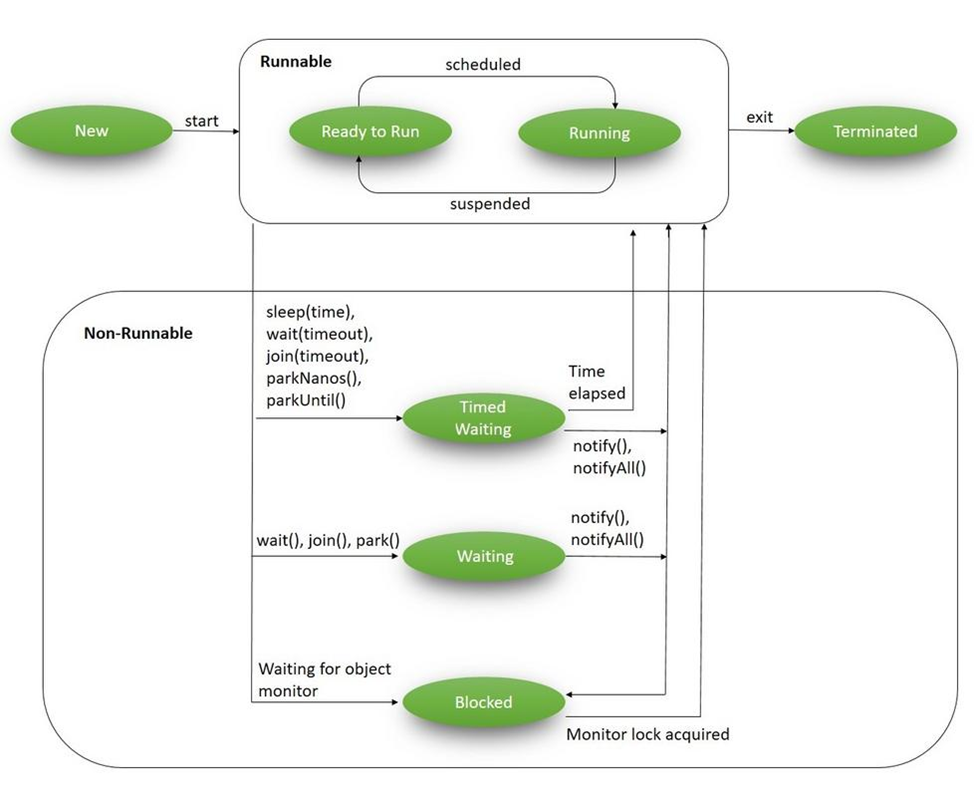

### 1.10 Многопоточность

**Параллелизм** — это когда несколько задач выполняются действительно одновременно. Например, если у вас дома две стиральные машины — вы можете запустить две стирки параллельно.
**Конкурентность** — это когда задачи выполняются по очереди, но так, что создаётся ощущение одновременности. Например, если у вас одна стиральная машина: вы загрузили стирку, пока она идёт — убираете квартиру, потом проверяете стирку, затем отвечаете на сообщения. Всё происходит «в одно время», хотя физически — по очереди.
**Параллелизм** зависит от количества ресурсов (ядер, машинок), а **конкурентность** — от того, как вы организуете работу.

В Java многопоточность реализована через класс Thread и интерфейс Runnable. Вот основные моменты, которые могут быть полезны при работе с многопоточностью:

1. **Создание и запуск потока**

Поток может быть создан двумя способами:
- Наследование от класса Thread:
```java
       class MyThread extends Thread {
           public void run() {
               // Код, выполняемый в потоке
           }
       }
       MyThread t = new MyThread();
       t.start();
```
- Реализация интерфейса Runnable:
```java
       class MyRunnable implements Runnable {
           public void run() {
               // Код, выполняемый в потоке
           }
       }
       Thread t = new Thread(new MyRunnable());
       t.start();
```
2. **Основные методы класса Thread**
   - start() — запуск потока.
   - sleep(long millis) — приостановка потока на определенное время.
   - join() — ожидание завершения потока.
   - interrupt() — прерывание потока.
   - isAlive() — проверка, работает ли поток.
3. **Синхронизация**
 
Чтобы избежать проблем с конкурентным доступом к данным, используется синхронизация:
```java
     synchronized (this) {
         // Критическая секция
     }
```
Это гарантирует, что только один поток может выполнить код внутри синхронизированного блока.
4. **Пул потоков**

Для управления большим количеством потоков используется пул потоков, который управляется через ExecutorService. Пример:
```java
     ExecutorService executor = Executors.newFixedThreadPool(10);
     executor.submit(() -> {
         // Задача для потока
     });
     executor.shutdown();
```
5. **Состояния потока**
Потоки могут находиться в разных состояниях:
   - **NEW:** Поток создан, но не запущен.
   - **RUNNABLE:** Поток готов к выполнению.
   - **WAITING:** Поток ожидает другого потока.
   - **TIMED_WAITING:** Поток ожидает в течение определенного времени.
   - **TERMINATED:** Поток завершен.

6. **Проблемы многопоточности**

   - **Состояние гонки (Race condition)** — ситуация, когда несколько потоков одновременно пытаются изменить данные, что может привести к некорректным результатам.
   - **Блокировки** — проблемы с мертвыми блокировками (deadlocks), когда потоки навсегда блокируются, ожидая друг друга.

7. Современные подходы и классы

- **ForkJoinPool** — используется для параллельного выполнения задач с разделением на подзадачи.
- **CountDownLatch, CyclicBarrier, Semaphore** — различные утилиты для синхронизации между потоками.

8. Параллельное выполнение коллекций
Коллекции в Java также могут работать с потоками через parallelStream():
```java
     List<Integer> list = Arrays.asList(1, 2, 3, 4, 5);
     list.parallelStream().forEach(System.out::println);
```
Многопоточность — мощный инструмент для улучшения производительности приложений, но требует внимательности при реализации, чтобы избежать ошибок, таких как мертвые блокировки или некорректный доступ к данным.

#### Техники проектирования потокобезопасного класса

1. Классы без состояния: нет состояния — нет проблемы
2. Неизменяемые классы: только для чтения — ваш друг
3. Инкапсуляция и синхронизация
    - Сделайте поля приватными
    - Выявите неатомарные операции и синхронизируйте их
    - Ключевое слово volatile для видимости
    - Широкая и узкая синхронизация 
        
        Широкая синхронизация означает использование меньшего количества более широких блокировок, которые защищают большие участки кода или структуры данных. Например, блокировка всего списка, когда нужно изменить только один элемент, или блокировка всего метода, даже если только часть метода нуждается в синхронизации.
        
        Узкая синхронизация означает использование множества мелких, целенаправленных блокировок, которые защищают конкретные компоненты или операции. Например, блокировка только того элемента списка, который вы изменяете.

4. Использование потокобезопасных библиотек 
5. Изоляция потока: каждый со своим набором данных
6. Оборонительное копирование: защита внутренних данных

 **Классы без состояния устраняют общее состояние полностью.**
 
 **Неизменяемые классы защищены от любых изменений после создания.**
 
 **Правильная инкапсуляция с синхронизацией защищает изменяемое состояние.**
 
 **Готовые библиотеки — отличный фундамент для создания сложных потокобезопасных решений.**
 
 **Ограничение потока изолирует состояние в отдельных потоках.**
 
 **Оборонительное копирование защищает от внешних изменений.**
 
 **Выбор, где и как лочить, — это всегда компромисс между стабильностью и скоростью.** 

#### Atomic
В Java atomic относится к классу java.util.concurrent.atomic, предоставляющему атомарные операции для работы с примитивными типами данных и объектами. Атомарные операции гарантируют, что операции чтения и записи выполняются как неделимое целое, не прерываемое другими потоками. Это полезно для обеспечения потокобезопасности в многопоточных приложениях, особенно при работе с общими переменными. 

Условно можно разделить подходы реализации большинства atomic-методов на две группы: compare-and-set и set-and-get.

Методы категории compare-and-set принимают старое значение и новое. Если переданное старое значение совпало с текущим, устанавливается новое. Обычно делегируют вызов в методы класса Unsafe, которые заменяются нативными реализациями виртуальной машины. Виртуальная машина в большинстве случаев использует атомарную операцию процессора compare-and-swap (CAS). Поэтому атомики обычно более эффективны чем стандартная дорогостоящая блокировка.

В случае set-and-get старое значение неизвестно. Поэтому нужен небольшой трюк: программа сначала считывает текущее значение, а затем записывает новое, тоже с помощью CAS, потому что запись могла успеть поменяться даже за этот шаг. Эта попытка чтения+записи повторяется в цикле, пока старое значение не совпадет и переменная не будет успешно записана.

#### CountDownLatch
**CountDownLatch** (появился в JDK 5) - это утилитарный класс, который блокирует набор потоков до завершения некоторой операции.
**CountDownLatch** инициализируется счетчиком (тип Integer), который уменьшается по мере завершения выполнения зависимых потоков. Но как только счетчик достигает нуля, другие потоки освобождаются.

#### CyclicBarrier
**CyclicBarrier** работает практически так же, как и **CountDownLatch**, за исключением того, что мы можем использовать его повторно. В отличие от CountDownLatch, он позволяет нескольким потокам ожидать друг друга с помощью метода await() (известного как барьерное условие) перед вызовом конечной задачи.

#### Semaphore
Семафор используется для блокирования доступа на уровне потоков к некоторой части физического или логического ресурса. Семафор содержит набор разрешений; всякий раз, когда поток пытается войти в критическую секцию, он должен проверить семафор на наличие или отсутствие разрешения.

#### Phaser
**Phaser** является более гибким решением, чем **CyclicBarrier** и **CountDownLatch**, - он используется в качестве многоразового барьера, на котором динамическое число потоков должно подождать перед продолжением выполнения. Мы можем координировать несколько фаз выполнения, повторно используя экземпляр **Phaser** для каждой фазы программы.

#### Concurrent Collections
Это коллекции из java.util.concurrent, безопасные для многопоточного доступа без внешней синхронизации.


#### ForkJoinPool

ForkJoinPool – специальный вид ExecutorService (пулла потоков), который появился в Java с версии 7. Предназначен для выполнения рекурсивных задач.

Задача для сервиса представляется экземпляром класса ForkJoinTask. В основном используются подклассы RecursiveTask и RecursiveAction, для задач с результатом и без соответственно. Аналогично интерфейсам Callable и Runnable обычного ExecutorService.

Тело рекурсивной операции задается в реализации метода compute() задачи ForkJoinTask. Здесь же создаются новые подзадачи, и запускаются параллельно методом fork(). Чтобы дождаться завершения выполнения задачи, на каждой форкнутой подзадаче вызывается блокирующий метод join(), результат выполнения при необходимости агрегируется.

С точки зрения использования метод ForkJoinTask.join() похож на аналогичный метод класса Thread. Но в случае fork-join поток может на самом деле не заснуть, а переключиться на выполнение другой задачи. Такая стратегия называется work stealing, и позволяет эффективнее использовать ограниченное количество потоков. Это похоже на переиспользование потоков корутинах Kotlin.

#### Executor, ExecutorService

В Java **Executor framework** предоставляет удобный способ управления выполнением задач в нескольких потоках. Он включает в себя интерфейсы Executor, ExecutorService и ScheduledExecutorService, а также классы для создания пулов потоков, такие как ThreadPoolExecutor. Использование Executor позволяет отделить процесс выполнения задач от конкретной реализации потоков, что упрощает управление многопоточностью и повышает гибкость кода.

**ExecutorService** в Java предоставляет удобный способ управления пулом потоков для выполнения асинхронных задач. Он позволяет запускать задачи, переданные в виде объектов Runnable или Callable, и предоставляет методы для управления жизненным циклом этих задач и пула потоков. ExecutorService упрощает асинхронное программирование, позволяя разработчикам не заботиться о низкоуровневом управлении потоками
ExecutorService:
- **ThreadPoolExecutor:** Наиболее распространенная реализация, предоставляющая пул потоков с настраиваемым размером.
- **ScheduledThreadPoolExecutor:** Позволяет выполнять задачи с задержкой или периодически.
- **CachedThreadPoolExecutor:** Создает пул потоков по мере необходимости и повторно использует свободные потоки.
- **ForkJoinPool:** Используется для разбиения сложных задач на подзадачи, которые выполняются параллельно.
  
 
**Методы ExecutorService:**

- **execute(Runnable command):** Запускает переданную задачу в потоке из пула. Не возвращает результат.
- **submit(Runnable task):** Запускает переданную задачу и возвращает Future объект, который можно использовать для получения результата или проверки статуса выполнения.
- **submit(Callable<T> task):** Запускает переданную задачу и возвращает Future<T>, где T - тип результата, возвращаемого Callable.
- **shutdown():** Позволяет остановить прием новых задач, но позволяет завершиться уже запущенным задачам.
- **shutdownNow():** Пытается остановить текущие выполняющиеся задачи и отменяет ожидающие задачи.
- **awaitTermination(long timeout, TimeUnit unit):** Ожидает завершения всех задач в пуле в течение заданного времени.

**Future**
**Future** представляет будущий результат асинхронного вычисления. Этот результат в конечном итоге появится в Future после завершения обработки.
Более того, API cancel(boolean mayInterruptIfRunning) отменяет операцию и освобождает выполняющий ее поток. Если значение параметра mayInterruptIfRunning равно true, то поток, выполняющий задачу, будет немедленно завершен.
**CompletableFuture** - Это расширение класса Future, которое предоставляет возможность более гибкой работы с асинхронными операциями. CompletableFuture позволяет явно управлять завершением операции, комбинировать несколько операций в цепочку и выполнять дополнительные действия по ее завершению.
- **thenApply** — применяет функцию к результату предыдущей задачи, возвращает новый CompletableFuture.
- **thenCompose** — разворачивает вложенный CompletableFuture, используется для последовательного асинхронного выполнения.
- **allOf / anyOf** — комбинируют несколько CompletableFuture:
- **Асинхронное выполнение** — можно запускать задачи в отдельном пуле потоков.

#### Runnable vs Extending a Thread vs. Callable
Расширяя класс Thread, мы не переопределяем ни один из его методов. Вместо этого мы переопределяем метод Runnable (который, как оказалось, реализует Thread). Это является явным нарушением принципа IS-A Thread
Создание реализации Runnable и передача ее классу Thread использует композицию, а не наследование, что является более гибким.
Начиная с Java 8, Runnables могут быть представлены в виде лямбда-выражений.
Оба интерфейса предназначены для представления задачи, которая может выполняться несколькими потоками. Запускать задачи Runnable можно с помощью класса Thread или ExecutorService, а Callables - только с помощью последнего.

#### Общие моменты многопоточности
**wait(), notify(), notifyAll()** 
- wait() — поток ждёт и отпускает монитор.
- notify() — будит один поток, ждущий на этом объекте.
- notifyAll() — будит всех.

**Synchronized**
Мы можем использовать ключевое слово synchronized на разных уровнях:
1. Методы экземпляра 
2. Статические методы
3. Блоки кода

**Volatile**
**volatile** - довольно полезное ключевое слово, поскольку с его помощью можно обеспечить видимость изменений данных, не обеспечивая при этом взаимного исключения. Таким образом, оно полезно в тех случаях, когда мы не против параллельного выполнения блока кода несколькими потоками, но нам необходимо обеспечить свойство видимости.

**Happens-before**
**Happens-before** — это базовое правило модели памяти Java, которое определяет, какие изменения одного потока гарантированно видит другой поток.
**Memory Visibility** - В многопоточной среде каждый поток может работать со своими копиями данных, лежащими в кэше ядра CPU.
Когда один поток обновляет переменные, нет гарантии, что другой поток сразу увидит эти изменения в основной памяти.

**Виды Locks**
- **synchronized блок:** это ключевое слово в Java, которое может использоваться для ограничения доступа к коду только одним потоком. Этот блок может быть использован для синхронизации методов или блоков кода.
- **ReentrantLock:** это класс, реализующий интерфейс Lock, который предоставляет более гибкие возможности блокировки. Он позволяет использовать более сложные сценарии блокировки, такие как блокировка с ожиданием определенного времени, блокировка с попыткой прервать ожидание и другие.
- **ReadWriteLock:** это интерфейс, предоставляющий две блокировки - одну для чтения и одну для записи. Эта схема позволяет нескольким потокам выполнять операции чтения одновременно, но блокирует доступ на запись во время обновления данных.
- **StampedLock:** lock с поддержкой write/read и ultra-fast optimistic read, который ускоряет чтение и снижает contention в многопоточности. 

**Deadlock vs Livelock**
- **Deadlock (взаимная блокировка)** - Потоки навсегда блокируют друг друга, каждый ждёт ресурс, удерживаемый другим. Итог: система стоит, прогресса нет.
  Как избегать:
  - Всегда блокировать ресурсы в одном порядке.
  - Использовать таймауты при захвате блокировок (tryLock(timeout)).
  - Минимизировать количество одновременно захватываемых блокировок.
- **Livelock (ожившая блокировка)** - Потоки не заблокированы, но бесполезно двигаются, постоянно пытаясь избежать конфликта и мешая друг другу. Итог: система работает, но прогресса тоже нет.
  Как избегать:
   - Добавлять рандомные задержки или экспоненциальный бэкофф при повторных попытках.
   - Использовать явные таймауты и прекращать попытки через определённое время.
   - Пересматривать алгоритм кооперации, чтобы не блокировать друг друга непрерывно.

#### Назови 5 классов из пакеты concurrent и зачем они нужны
1) **CompletableFuture** - позволяет запускать асинхронные задачи, комбинировать их, цеплять колбэки и работать без блокировок. Упрощает параллелизм.

2) **ConcurrentHashMap** - потокобезопасный HashMap. Позволяет многим потокам одновременно читать и обновлять данные без общего большого локa.

3) **Phaser** - продвинутый синхронизатор, позволяет синхронизировать потоки по фазам (этапам). Гибче, чем CyclicBarrier/CountDownLatch.

4) **AtomicInteger** - примитив для атомарных операций над int без использования локов (CAS). Нужен для счетчиков, флагов и инкрементов между потоками.

5) **ReentrantLock** - явная блокировка с расширенными возможностями: tryLock, fairness, condition-переменные. Более гибкая альтернатива synchronized.
   


