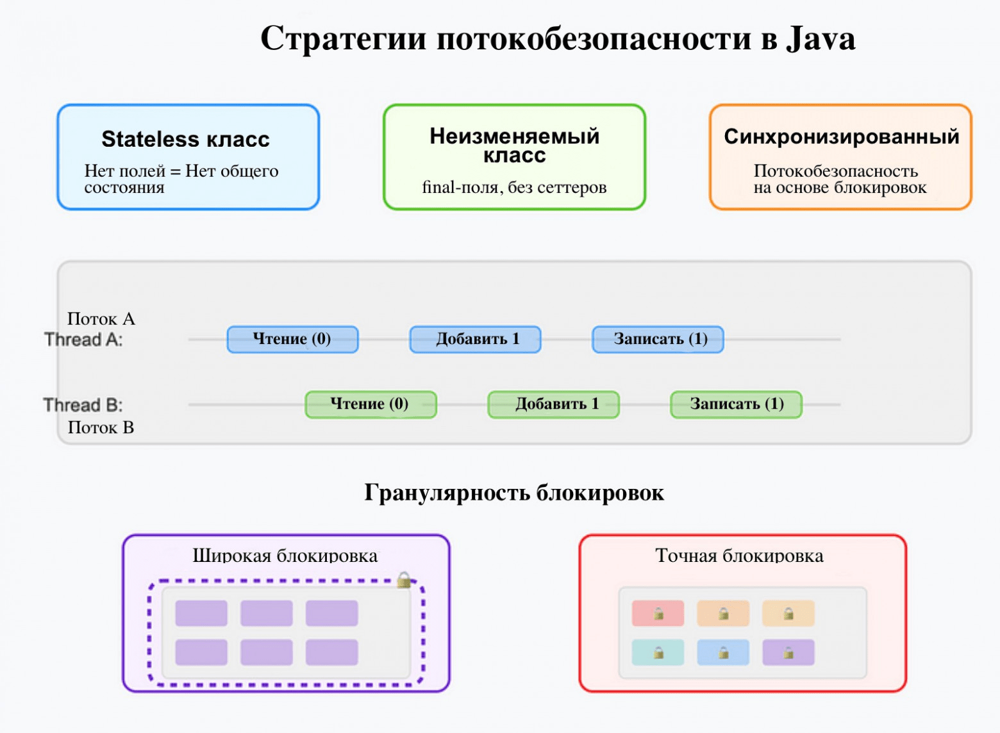

### 1.10 Многопоточность

#### Техники проектирования потокобезопасного класса

1. Классы без состояния: нет состояния — нет проблемы
2. Неизменяемые классы: только для чтения — ваш друг
3. Инкапсуляция и синхронизация
    - Сделайте поля приватными
    - Выявите неатомарные операции и синхронизируйте их
    - Ключевое слово volatile для видимости
    - Широкая и узкая синхронизация 
        
        Широкая синхронизация означает использование меньшего количества более широких блокировок, которые защищают большие участки кода или структуры данных. Например, блокировка всего списка, когда нужно изменить только один элемент, или блокировка всего метода, даже если только часть метода нуждается в синхронизации.
        
        Узкая синхронизация означает использование множества мелких, целенаправленных блокировок, которые защищают конкретные компоненты или операции. Например, блокировка только того элемента списка, который вы изменяете.

4. Использование потокобезопасных библиотек 
5. Изоляция потока: каждый со своим набором данных
6. Оборонительное копирование: защита внутренних данных

 **Классы без состояния устраняют общее состояние полностью.**
 
 **Неизменяемые классы защищены от любых изменений после создания.**
 
 **Правильная инкапсуляция с синхронизацией защищает изменяемое состояние.**
 
 **Готовые библиотеки — отличный фундамент для создания сложных потокобезопасных решений.**
 
 **Ограничение потока изолирует состояние в отдельных потоках.**
 
 **Оборонительное копирование защищает от внешних изменений.**
 
 **Выбор, где и как лочить, — это всегда компромисс между стабильностью и скоростью.** 

#### Atomic
В Java atomic относится к классу java.util.concurrent.atomic, предоставляющему атомарные операции для работы с примитивными типами данных и объектами. Атомарные операции гарантируют, что операции чтения и записи выполняются как неделимое целое, не прерываемое другими потоками. Это полезно для обеспечения потокобезопасности в многопоточных приложениях, особенно при работе с общими переменными. 

Условно можно разделить подходы реализации большинства atomic-методов на две группы: compare-and-set и set-and-get.

Методы категории compare-and-set принимают старое значение и новое. Если переданное старое значение совпало с текущим, устанавливается новое. Обычно делегируют вызов в методы класса Unsafe, которые заменяются нативными реализациями виртуальной машины. Виртуальная машина в большинстве случаев использует атомарную операцию процессора compare-and-swap (CAS). Поэтому атомики обычно более эффективны чем стандартная дорогостоящая блокировка.

В случае set-and-get старое значение неизвестно. Поэтому нужен небольшой трюк: программа сначала считывает текущее значение, а затем записывает новое, тоже с помощью CAS, потому что запись могла успеть поменяться даже за этот шаг. Эта попытка чтения+записи повторяется в цикле, пока старое значение не совпадет и переменная не будет успешно записана.

#### ForkJoinPool

ForkJoinPool – специальный вид ExecutorService (пулла потоков), который появился в Java с версии 7. Предназначен для выполнения рекурсивных задач.

Задача для сервиса представляется экземпляром класса ForkJoinTask. В основном используются подклассы RecursiveTask и RecursiveAction, для задач с результатом и без соответственно. Аналогично интерфейсам Callable и Runnable обычного ExecutorService.

Тело рекурсивной операции задается в реализации метода compute() задачи ForkJoinTask. Здесь же создаются новые подзадачи, и запускаются параллельно методом fork(). Чтобы дождаться завершения выполнения задачи, на каждой форкнутой подзадаче вызывается блокирующий метод join(), результат выполнения при необходимости агрегируется.

С точки зрения использования метод ForkJoinTask.join() похож на аналогичный метод класса Thread. Но в случае fork-join поток может на самом деле не заснуть, а переключиться на выполнение другой задачи. Такая стратегия называется work stealing, и позволяет эффективнее использовать ограниченное количество потоков. Это похоже на переиспользование потоков корутинах Kotlin.

#### Executor, ExecutorService

В Java **Executor framework** предоставляет удобный способ управления выполнением задач в нескольких потоках. Он включает в себя интерфейсы Executor, ExecutorService и ScheduledExecutorService, а также классы для создания пулов потоков, такие как ThreadPoolExecutor. Использование Executor позволяет отделить процесс выполнения задач от конкретной реализации потоков, что упрощает управление многопоточностью и повышает гибкость кода.

**ExecutorService** в Java предоставляет удобный способ управления пулом потоков для выполнения асинхронных задач. Он позволяет запускать задачи, переданные в виде объектов Runnable или Callable, и предоставляет методы для управления жизненным циклом этих задач и пула потоков. ExecutorService упрощает асинхронное программирование, позволяя разработчикам не заботиться о низкоуровневом управлении потоками
ExecutorService:
- **ThreadPoolExecutor:** Наиболее распространенная реализация, предоставляющая пул потоков с настраиваемым размером.
- **ScheduledThreadPoolExecutor:** Позволяет выполнять задачи с задержкой или периодически.
- **CachedThreadPoolExecutor:** Создает пул потоков по мере необходимости и повторно использует свободные потоки.
- **ForkJoinPool:** Используется для разбиения сложных задач на подзадачи, которые выполняются параллельно.
  
 
**Методы ExecutorService:**

- **execute(Runnable command):** Запускает переданную задачу в потоке из пула. Не возвращает результат.
- **submit(Runnable task):** Запускает переданную задачу и возвращает Future объект, который можно использовать для получения результата или проверки статуса выполнения.
- **submit(Callable<T> task):** Запускает переданную задачу и возвращает Future<T>, где T - тип результата, возвращаемого Callable.
- **shutdown():** Позволяет остановить прием новых задач, но позволяет завершиться уже запущенным задачам.
- **shutdownNow():** Пытается остановить текущие выполняющиеся задачи и отменяет ожидающие задачи.
- **awaitTermination(long timeout, TimeUnit unit):** Ожидает завершения всех задач в пуле в течение заданного времени.

