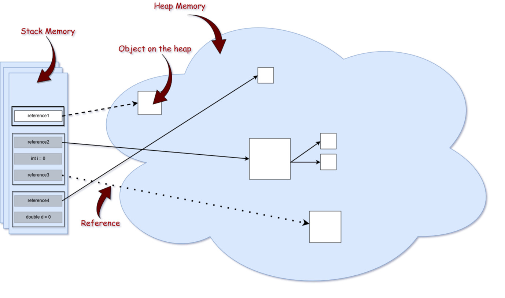
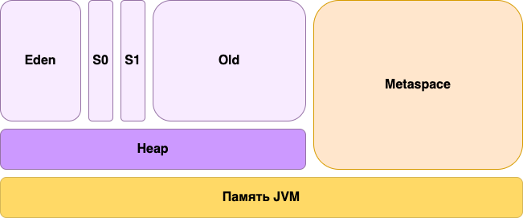

### 1.12 Сборщики мусора и модели памяти

#### 1.12.1 Сборщик мусора

GC - механизм JVM, который автоматически освобождает память, занятую объектами, на которые больше нет ссылок.

В современных JVM один Garbage Collector может использовать разные алгоритмы для разных областей памяти:
- **Copying (копирующий)** — применяется в Young Generation. Он быстро копирует живые объекты в новый участок памяти, а все остальное считается мусором.
- **Mark-Sweep-Compact** (отметь-удали-компактизируй) — чаще применяется в **Old Generation**. Сначала помечаются живые объекты (Mark), затем удаляются мусорные (Sweep), и оставшиеся уплотняются (Compact), чтобы избежать фрагментации.

#### Serial Garbage Collector

Лучший вариант для однопоточных приложений с небольшими кучами. Он использует один поток для выполнения как малых, так и больших сборок мусора, что приводит к значительным паузам, но минимальной нагрузке на систему.
    - Использует один поток для всех фаз GC.
    - Подходит для однопоточных приложений и небольших heap.
    - Алгоритм: "copying" (в Young Gen) и "mark-sweep-compact" (в Old Gen).
    - Параметр: -XX:+UseSerialGC

#### Parallel Garbage Collector

Подходит для приложений с высокими требованиями к пропускной способности. Использует несколько потоков для выполнения как малых, так и больших сборок мусора, уменьшая время пауз, но при этом увеличивая использование CPU.
    - Использует несколько потоков для работы в Young и Old Gen.
    - Цель — максимальная пропускная способность, а не минимизация пауз.
    - Подходит для серверных приложений без строгих требований к задержкам.
    - Параметр: -XX:+UseParallelGC

#### Concurrent Mark-Sweep (CMS) Garbage Collector

Разработан для минимизации пауз за счёт выполнения основной части работы по сборке мусора параллельно с выполнением приложений. Подходит для приложений, где критически важна низкая задержка.
    - Работает параллельно с приложением (concurrent), уменьшая stop-the-world паузы.
    - Этапы: initial mark, concurrent mark, remark, sweep.
    - Не компактизирует память (может привести к фрагментации).
    - Устарел начиная с Java 9 и удалён в Java 14
    - Параметр: -XX:+UseConcMarkSweepGC

#### G1 Garbage Collector

Сбалансированный сборщик мусора, который стремится обеспечить предсказуемое время пауз, разделяя кучу на регионы и выполняя сборку мусора поэтапно. Является хорошим выбором по умолчанию для большинства приложений.
    - Делит heap на множество регионов.
    - Каждый регион может быть частью Young или Old Generation.
    - Этапы GC включают: Initial Mark, Concurrent Mark, Remark, Cleanup, Copy.
    - Работает по принципу "сборка сначала самых мусорных регионов" (Garbage First).
    - Использует предсказуемые паузы и старается не превышать MaxGCPauseMillis
    - Поддерживает инкрементальную, concurrent и компактизирующую сборку Old Gen.
    - G1 ведёт статистику "полезности" регионов и выбирает наиболее эффективные для сборки.
    - Параметр: -XX:+UseG1GC
    - По умолчанию используется с Java 9+

#### Z Garbage Collector и Shenandoah

Сборщики мусора с ультранизкой задержкой, разработанные для работы с большими кучами. Основная часть работы по сборке мусора выполняется параллельно, что позволяет минимизировать время пауз даже при очень больших кучах.
**ZGC (Z Garbage Collector)**
    - Поддерживает heap до терабайт.
    - Работает с паузами менее 10 мс, независимо от размера heap.
    - Полностью concurrent (почти все фазы выполняются параллельно с приложением).
    - Подходит для latency-чувствительных систем.
    - Параметр: -XX:+UseZGC

**Shenandoah**
    - Похож на ZGC, с акцентом на короткие паузы.
    - Использует concurrent compacting.
    - Поддерживается OpenJDK.
    - Параметр: -XX:+UseShenandoahGC

#### Паузы

- Stop-the-world – при некоторых фазах GC все потоки приостанавливаются.
- Minor GC – в Young Generation.
- Major/Full GC – в Old Generation, может включать очистку Metaspace.

#### Performance и тюнинг

- -Xms / -Xmx – минимальный/максимальный размер heap.
- -Xss – размер стека на поток.
- -Xss – размер стека на поток.
- -XX:+PrintGCDetails, -Xlog:gc


#### 1.12.2 Модель памяти

**Runtime Data Areas**
- **Heap** – область, где живут все объекты.
- **Method Area (Metaspace)** – содержит метаинформацию классов, константный пул.
- **JVM Stack** – создается на поток, содержит фреймы вызовов методов.
- **Program Counter Register (PC Register)** — это маленький указатель, который хранит номер следующей команды, которую должен выполнить поток.
- **Native Method Stack** – стек для вызова нативных методов.

**Execution Engine**
- **Interpreter** – пошаговая интерпретация bytecode.
- **JIT Compiler (Just-In-Time)** – компилирует часто используемые методы в машинный код.
- **GC Interface – Execution Engine** тесно связана со сборщиком мусора: он должен знать, когда объект больше не используется, и правильно освобождать память.

**Delegation Model**

**Delegation Model** (модель делегирования ClassLoader-ов) — это механизм, с помощью которого JVM загружает классы в строгом порядке сверху вниз, чтобы избежать конфликтов и дублирования.
Когда ClassLoader хочет загрузить класс, **он сначала делегирует эту задачу своему родителю**, и только если родитель не нашёл класс, он загружает его сам.




#### Стек (Stack)

Стек используется для хранения локальных переменных, параметров методов и возвращаемых значений, а также для управления вызовами методов.
    - Здесь хранятся локальные переменные метода, включая ссылки на объекты в куче.
    - Когда метод завершает выполнение, его фрейм из стека удаляется.
Каждый поток имеет свой собственный стек, состоящий из фреймов вызова методов. В каждом фрейме хранятся:
    - локальные переменные метода,
    - операндный стек для промежуточных вычислений,
    - ссылка на constant pool класса, чтобы использовать константы и методы этого класса.

#### Куча (Heap)

Куча используется для хранения объектов, созданных во время выполнения программы.
    - Здесь хранятся экземпляры объектов.
    - Для каждого объекта выделяется место под его поля (данные).
    - Ссылки на объекты тоже создаются, но обычно эти ссылки хранятся в стеке или в полях других объектов на куче.


**Young Generation**
- **Eden**
Это сегмент heap области в который свежесозданные объекты попадают в первую очередь. Каждый раз, когда в Java приложении выполняется инструкция new, память, выделяемая под новый инстанс, выделяется именно в Eden сегменте.
Для этого правила есть исключения - если размер памяти, необходимый для хранения инстанса достаточно большой, то JVM может выделить память под него сразу в Old Gen сегменте.
Надолго свежесозданные объекты в Eden сегменте не задержатся. После первого же запуска процесса сборки мусора, они либо будут удалены из памяти, либо будут перенесены в Survival сегменты heap'а.

- **S0 и S1 - Survival**
Survival сегмент области heap'а используется JVM для хранения объектов, которые пережили один и более проходов сборщика мусора.
Survival сегмент представлен в JVM двумя сегментами - S0 и S1. Они служат неким "перевалочным пунктом" для объектов на пути к Old Gen сегменту. В S0 и S1 сегментах объекты могут провести какое-то время до тех пор, пока они не будут удалены из памяти или переведены в Old Gen сегмент.
Если быть точным, то в JVM есть настройка, позволяющая указать количество запусков сборки мусора, которое объект должен пережить, для того, чтобы попасть в Old Gen сегмент. По умолчанию, это количество равно 15.
Почему Survival область представлена двумя сегментами S0 и S1? Всё дело в том, что для ускорения очистки памяти и исправления её фрагментации, в ходе процесса сборки мусора два этих сегмента дефрагминтируются и меняются местами.

- **Old Gen**
Old Gen сегмент heap'а используется для хранения объектов, которые пережили установленное количество запусков сборки мусора.
Полная схема памяти Java процесса выглядит следующим образом:



**Управление Heap**

Управлять heap областью можно с помощью следующих флагов JVM:

- -Xms - минимальный объём памяти всей области
- -Xmx - максимальный объём памяти всей области
- -XX:NewSize - минимальный объём памяти Eden сегмента
- -XX:MaxNewSize - максималный объём памяти Eden сегмента
- -XX:SurvivorRatio - соотношение между объёмами памяти Eden и Survival сегментов

#### Metaspace

Metaspace - это область памяти в которой хранится статическая инфорация Java приложения, такая как метаданные загруженных классов. По умолчанию, metaspace увеличивается автоматически и не имеет явного ограничения. Без установленного ограничения размер metaspace неявно ограничен объёмом системной памяти хоста.
    - Что хранится: информация о классах — их метаданные, методы, константы, аннотации.
    - Отличие от PermGen: в Java 8+ PermGen убрали, а Metaspace хранится в нативной памяти, а не в heap. Это позволяет JVM динамически расширять пространство для метаданных без жёсткого лимита (если не задан -XX:MaxMetaspaceSize).
    - Рост и лимиты: растёт по мере загрузки новых классов; можно ограничить через JVM параметры (MaxMetaspaceSize, MetaspaceSize).

Управлять metaspace областью можно с помощью следующих флагов JVM:

- -XX:MetaspaceSize - минимальный объём памяти для области
- -XX:MaxMetaspaceSize - максимальный объём памяти для области
- -XX:MinMetaspaceFreeRatio - минимально зарезервированный размер памяти после очистки GC (в процентах)
- -XX:MaxMetaspaceFreeRatio - максимально зарезервированный размер памяти после очистки GC (в процентах)

#### Off-heap Memory
Это память, выделяемая вне стандартного heap JVM, напрямую в нативной памяти.
- Примеры:
    - ByteBuffer.allocateDirect() — прямой буфер для работы с нативной памятью, минуя GC.
    - Пулы нативных ресурсов, кэширование больших данных.
- Опасности:
  - JVM не отслеживает эту память, поэтому утечки возможны.
  - Неправильное освобождение памяти (DirectByteBuffer) может привести к OutOfMemoryError, даже если heap пустой.

#### Constant pool
**Constant Pool** — это специальное место в метаданных класса (часть Method Area в JVM), где хранятся константы, литералы и ссылки на методы/классы. То есть constant pool — это как шкаф с готовыми вещами, а stack — это стол, на котором ты их раскладываешь для работы.

**============ Не основные ============**

#### Область методов

Область методов хранит метаданные классов, такие как константный пул, код методов и другую информацию, необходимую для работы с классами.

#### Область нативных методов

Область нативных методов используется для хранения данных, необходимых для выполнения нативных (не Java) методов

#### PC Register

Каждый поток в JVM имеет свой собственный PC Register. Он используется для отслеживания текущей позиции выполнения потока в программе

#### Типы ссылок

**Strong Reference (сильная ссылка)**

Это самые популярные ссылочные типы, к которым мы все привыкли. В приведенном выше примере со StringBuilder мы фактически храним сильную ссылку на объект из кучи. Объект в куче не удаляется сборщиком мусора, пока на него указывает сильная ссылка или если он явно доступен через цепочку сильных ссылок.
    - Это обычные ссылки, которые мы используем каждый день.
    - Пока на объект существует хотя бы одна сильная ссылка — он не подлежит сборке мусора.
    - Чтобы объект мог быть собран, все сильные ссылки на него должны быть обнулены.

**Weak Reference (слабая ссылка)**

Попросту говоря, слабая ссылка на объект из кучи, скорее всего, не сохранится после следующего процесса сборки мусора. Слабая ссылка создается следующим образом:

```java
    import java.lang.ref.WeakReferencestringbuilder reference = new WeakReference<>(new StringBuilder());
```
   - Объект может быть собран немедленно, даже если только слабые ссылки на него остались.
   - Используется для реализации структур с автоудалением (например, WeakHashMap).
   - Часто применяется, когда объект должен быть доступен «до тех пор, пока он кому-то нужен».

Хорошим вариантом использования слабых ссылок являются сценарии кеширования. Представьте, что вы извлекаете некоторые данные и хотите, чтобы они также были сохранены в памяти - те же данные могут быть запрошены снова. С другой стороны, вы не уверены, когда и будут ли эти данные запрашиваться снова. Таким образом, вы можете сохранить слабую ссылку на него, и в случае запуска сборщика мусора, возможно, он уничтожит ваш объект в куче. Следовательно, через некоторое время, если вы захотите получить объект, на который вы ссылаетесь, вы можете внезапно получить null значение. Хорошей реализацией сценариев кеширования является коллекция WeakHashMap <K, V>. Если мы откроем WeakHashMap класс в Java API, мы увидим, что его записи фактически расширяют WeakReferenceкласс и используют его поле ref в качестве ключа отображения (Map):

```java
    /**
    * The entries in this hash table extend WeakReference, using its main ref
    * field as the key.
    */

    private static class Entry<K,V> extends WeakReference<Object> implements Map.Entry<K,V> {

        V value;
```

После сбора мусора ключа из WeakHashMap вся запись удаляется из карты.

**Soft Reference (мягкая ссылка)**

Эти типы ссылок используются для более чувствительных к памяти сценариев, поскольку они будут собираться сборщиком мусора только тогда, когда вашему приложению не хватает памяти. Следовательно, пока нет критической необходимости в освобождении некоторого места, сборщик мусора не будет касаться легко доступных объектов. Java гарантирует, что все объекты, на которые имеются мягкие ссылки, будут очищены до того, как будет выдано исключение OutOfMemoryError. В документации Javadocs говорится, что «все мягкие ссылки на мягко достижимые объекты гарантированно очищены до того, как виртуальная машина выдаст OutOfMemoryError».
    - Объект удаляется только при нехватке памяти.
    - Используется в кешах, чтобы не загружать память, но сохранить объект, если он ещё полезен.
    - Можно получить объект через ref.get(), но если GC уже удалил его — вернётся null.

Подобно слабым ссылкам, мягкая ссылка создается следующим образом:

```java
SoftReference<StringBuilder> reference = new SoftReference<>(new StringBuilder());
```

**Phantom Reference (фантомная ссылка)**

Используется для планирования посмертных действий по очистке, поскольку мы точно знаем, что объекты больше не живы. Используется только с очередью ссылок, поскольку .get()метод таких ссылок всегда будет возвращаться null. Эти типы ссылок считаются предпочтительными для финализаторов.
    - Объект уже помечен как удаляемый, но ещё не собран GC.
    - Метод get() всегда возвращает null.
    - Используется для контроля финализации и освобождения ресурсов вне heap (например, off-heap, native).
    - Требует ReferenceQueue, через которую можно узнать, что объект вот-вот будет удалён.
```java
PhantomReference<Object> ref = new PhantomReference<>(new Object(), referenceQueue);
```

### Class Loading и Reflectio

#### Class Loader Subsystem
JVM загружает классы с помощью системы загрузчиков (Class Loaders), которая реализует модель делегирования:
- **Bootstrap ClassLoader** – загружает стандартные классы из JDK (rt.jar или модули JDK).
- **Extension ClassLoader** – загружает библиотеки из ext директории.
- **Application ClassLoader** – загружает классы из classpath.
- Пользователь может создать **Custom ClassLoader** для динамической загрузки (например, в OSGi, плагинах).

**Delegation Model**
ClassLoader сначала делегирует загрузку родителю, и лишь потом пытается загрузить сам.

**Custom ClassLoaders**
Нужны для:
    - плагинов
    - модульных систем (OSGi, Spring Boot)
    - горячей перезагрузки кода

**Reflection**

Reflection позволяет динамически работать с классами и их членами, создавать прокси, но замедляет выполнение и может нарушать инкапсуляцию. SecurityManager может ограничивать такие операции. 