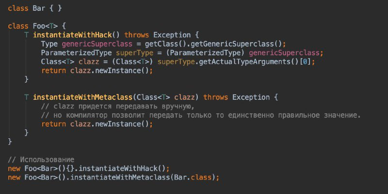

### 1.13 Generics

В Java дженерики (generics) - это механизм, который позволяет создавать классы, интерфейсы и методы, работающие с различными типами данных, при этом сохраняя безопасность типов во время компиляции. Другими словами, это способ создания обобщенного кода, который может быть использован с разными типами данных, не прибегая к приведению типов во время выполнения и не теряя информацию о типе.

#### Ковариантность, контравариантность и инвариантность

Ковариантность - это свойство типов, при котором порядок наследования сохраняется при переносе на производные типы.

Контравариантностью называется обращение иерархии исходных типов на противоположную в производных типах.

Инвариантность, в общем смысле, означает сохранение какого-либо свойства или характеристики при определенных преобразованиях или изменениях условий.

- Массивы в Java ковариантны. Тип S[] является подтипом T[], если S — подтип T.

- «Дженерики» инвариантны. То есть List\<Integer\> является только списком Integer. Для расширение вверх или низ нужно использовать WildCard "? extends ..." или "? super ..."

#### Стирание типов

Стирание типов (Type Erasure) в Java - это механизм, при котором информация о типах обобщений (generics) удаляется на этапе компиляции. В результате, обобщенные типы существуют только во время компиляции и не видны в байт-коде, вместо них используются "сырые" типы (raw types). Это сделано для обеспечения обратной совместимости с более старыми версиями Java, где обобщения еще не существовали.

В целом, стирание типов - это компромисс между типовой безопасностью и совместимостью, который позволяет использовать обобщения в Java без кардинальных изменений в работе виртуальной машины.

- **Обобщения (Generics):**
  В Java обобщения позволяют создавать классы, интерфейсы и методы, работающие с разными типами данных, при этом обеспечивая проверку типов на этапе компиляции.
- **Стирание типов:**
  На этапе компиляции компилятор заменяет все параметры типов в обобщенных типах на их границы (если есть) или на Object, если границы не указаны.
- **Пример:**
  Если у вас есть класс List<String>, то после стирания типов в байт-коде он будет представлен как List, то есть, как обычный список, без указания типа хранимых элементов.
- **Зачем нужно:**
  Стирание типов позволяет использовать обобщения в Java без необходимости перекомпилировать старый код, написанный до появления этой функциональности.
- **Последствия:**
  Из-за стирания типов, на этапе выполнения программы невозможно определить, какой именно тип был использован в обобщенном типе. Это может приводить к определенным ограничениям и особенностям при работе с обобщениями.
  - **Ограничения:**
    - Нельзя создавать экземпляры параметризованных типов. 
    Так писать нельзя
    ```Java
    List<String>[] array = new List<String>[10];
    ```
    - Нельзя создать массив из type parameter
    Так писать нельзя
  ```java
  class Box<T> {
      T[] array = new T[10];
  }
  ```
    - Нельзя напрямую создать экземпляр параметра типа
    - Нельзя перегружать методы, если после стирания сигнатуры совпадут
    - Нельзя использовать оператор instanceof с параметризованными типами 
Вот так нельзя: 
```java
    if (obj instanceof List<String>) {
```
  - Нельзя использовать примитивные типы в качестве параметров обобщений
  - Нельзя получить class literal параметризованного типа 
```java
Class<?> clazz = List<String>.class;
```
  - Нельзя использовать обобщенные типы в статических полях или методах
  - Нельзя использовать обобщенные типы в исключениях.
Так нельзя
```java
class MyException<T> extends Exception {
}
```
Как вариант 
```java
Class<?> clazz = List.class;
```
- **Bridge-методы:**
  Компилятор также генерирует так называемые bridge-методы для обеспечения корректной работы с обобщениями при наследовании.
 


#### Как инстанцировать экземпляр generic типа?

Внутри класса class Foo<T> на generic параметре T невозможно выполнить никакой оператор: нельзя взять его .class, нельзя применить его в instanceof. Также и вызов на нем оператора new приведет к ошибке.
Причина этих ограничений кроется в стирании типов. Дженерик параметры правильно воспринимать скорее как ограничения типов, чем как конкретные типы. Эти ограничения действуют для более строгих проверок на этапе компиляции. В рантайме же информация о конкретных переданных типах-параметрах стирается. А все эти операторы выполняются именно в рантайме.
Стандартный простой способ действия здесь – кроме значения типа T передавать еще и объект-дескриптор для этого типа, экземпляр класса Class<T>. Объект может быть создан из дескриптора рефлекшеном.
Но существует один хак, способный справиться со стиранием типов. Тип-параметр все-таки остается в одном месте в рантайме. Метод метакласса наследника определившего конкретный тип getGenericSuperclass() возвращает класс, которым параметризован родителью