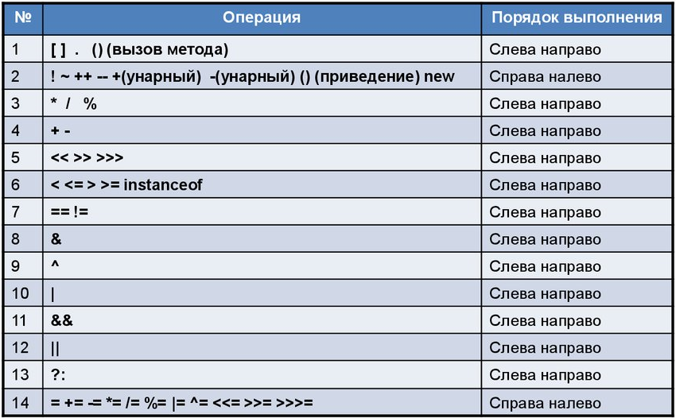
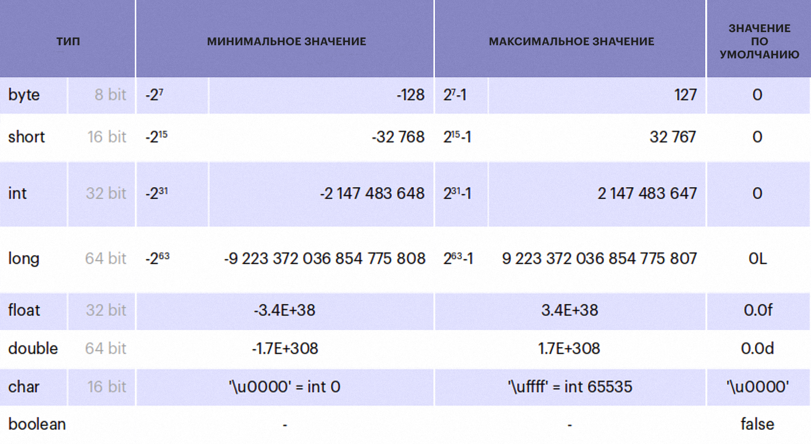
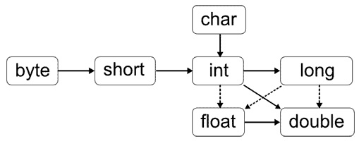
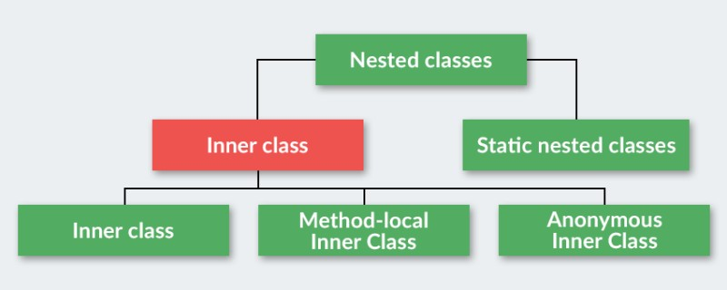

### 1.1 Основы

#### 1.1.1 Операции
Приоритет операций


#### 1.1.2 Типы данных

##### Boxing
|Тип данных	|Класс-обёртка|
|:-----------:|:-------------:|
|byte		|Byte         |
|short		|Short        | 
|int		|Integer      |
|long		|Long         |
|char		|Character    |  
|float		|Float        |
|double		|Double       |
|boolean	|Boolean      |

##### Приоритет приобразования типов


#### 1.1.3 Вложенные классы

- **Статические вложенные классы** Статические вложенные классы и не статические вложенные классы. Вложенные классы, объявленные статически, называются вложенными статическими классами.
```java
public class Building {
    private String name;

    public Building(String name) {
        this.name = name;
    }

    public static class Shop {
        private String shopName;
        private String address;

        public Shop(String shopName, String address) {
            this.shopName = shopName;
            this.address = address;
        }

        public String getShopName() {
            return shopName;
        }

        public String getAddress() {
            return address;
        }
    }

    public String getName() {
        return name;
    }
}
```
- **Внутренние классы** Внутренние классы — когда объект внутреннего класса связан с объектом обрамляющего класса. Не статические вложенные классы называются внутренними классами, если они связанны с внешним классом.
```java
public class OuterClass {
    private String outerData;

    public class InnerClass {
        public void printData() {
            System.out.println(outerData); // Доступ к outerData
        }
    }

    public OuterClass(String outerData) {
        this.outerData = outerData;
    }

    public InnerClass getInnerClass() {
        return new InnerClass();
    }
}
```
- **Локальные классы** Локальные классы — объявленные внутри блока кода и не являющиеся членом обрамляющего класса. В этом случае можно рассматривать класс как локальную переменную типа класс.
```java
public class OuterClass {

    private int outerVar = 10;

    public void doSomething() {
        final int localVariable = 20; // Локальная переменная должна быть final или effectively final для использования в локальном классе

        class LocalClass {
            public void printValues() {
                System.out.println("Outer variable: " + outerVar);
                System.out.println("Local variable: " + localVariable);
            }
        }

        LocalClass local = new LocalClass();
        local.printValues();
    }

    public static void main(String[] args) {
        OuterClass outer = new OuterClass();
        outer.doSomething();
    }
}
```
- **Анонимные (безымянные) классы** Анонимные классы – наследуемые, от какого либо класса, классы в которых при объявлении не задано имя класса. 
```java
public class OuterClass {
    public void doSomething() {
        Runnable r = new Runnable() {
            @Override
            public void run() {
                System.out.println("Anonymous class");
            }
        };
        r.run();
    }
}
```


