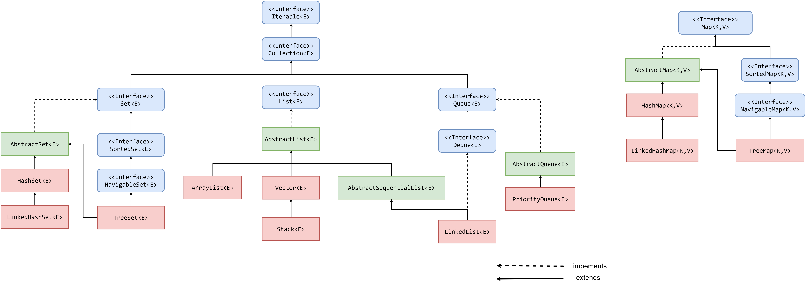

### 1.4 Коллекции и структуры данных

#### 1.4.1 Массивы (Arrays)
Массив – это структура данных, состоящая из упорядоченных ячеек, расположенных друг за другом в памяти, которые могут хранить в себе элементы только одного, заранее заданного типа.

Может хранить данные примитивных типов, строки (String) и ссылки на объекты класса.

Копирование массива System.arraycopy()

**Класс Arrays**
Класс Arrays содержит различные статические методы для работы с Массивами (например, сортировка и поиск).

#### Java Collections Framework (JCF). Коллекции

Интерфейс Iterable. Iterator. ListIterator.

#### 1.4.2 Списки (Lists)
**Класс ArrayList**
**Класс LinkedList**

#### 1.4.3 Сеты (Sets)
**Интерфейс Set**
**Класс HashSet**
**Класс LinkedHashSet**
**Интерфейс SortedSet**
**Интерфейс NavigableSet**
**Класс TreeSet**
**Класс EnumSet**
**Класс BitSet**

#### 1.4.4 Карты (Maps)
**Интерфейс Map**
**Интерфейс Map.Entry**
**Класс HashMap**
**Класс LinkedHashMap**
**Класс WeakHashMap**
**Интерфейс SortedMap**
**Интерфейс NavigableMap**
**Класс TreeMap**

#### 1.4.5 Очередь (Queue)
**Интерфейс Queue**
**Интерфейс Deque**
**Класс ArrayDeque**
**Класс PriorityQueue**

#### 1.4.6 Устаревшие коллекции
**Классы Vector и Stack**
**Класс Enumeration**
**Класс Dictionary**
**Класс Properties**
**Класс Hashtable**

#### 1.4.7 Потокобезопасные Concurrent коллекции
Пакет java.util.concurrent предоставляет реализации Конкурентных коллекций:
- ConcurrentHashMap – вместо HashMap
- ConcurrentSkipListMap – вместо TreeMap
- ConcurrentSkipListSet
- CopyOnWriteArrayList – вместо ArrayList
- CopyOnWriteArraySet

Блокирующие очереди реализуют интерфейсы BlockingQueue, BlockingDeque, TransferQueue
- ArrayBlockingQueue — очередь, реализующая классический кольцевой буфер;
- LinkedBlockingQueue — односторонняя очередь на связанных узлах;
- LinkedBlockingDeque — двунаправленная очередь на связанных узлах;
- SynchronousQueue — блокирующую очередь без емкости (операция добавления одного потока находится в ожидании соответствующей операции удаления в другом потоке);
- LinkedTransferQueue — реализация очереди на основе интерфейса TransferQueue;
- DelayQueue — неограниченная блокирующая очередь, реализующая интерфейс Delayed;
- PriorityBlockingQueue — реализация очереди на основе интерфейса PriorityQueue.

#### 1.4.8 Сортировка коллекций
Чтобы сортировать объекты в коллекции – нужно прописать правила их сравнения.
Для этого в классе, чьи объекты будут сортированы, должен быть интерфейс Comparable или Comparator.
- Comparable – естественная сортировка класса
- Comparator – используется, когда в классе не реализован Comparable, либо реализован, но с неподходящей нам логикой сравнения объектов.

**Интерфейс Comparable**
Интерфейс Comparable накладывает полный порядок на объекты каждого класса, который его реализует.

**Интерфейс Comparator**
Comparator используется, когда в классе не реализован, либо реализован с неподходящей логикой интерфейс Comparable, от чего нельзя сравнить объекты нужным образом.

https://habr.com/ru/articles/696184/