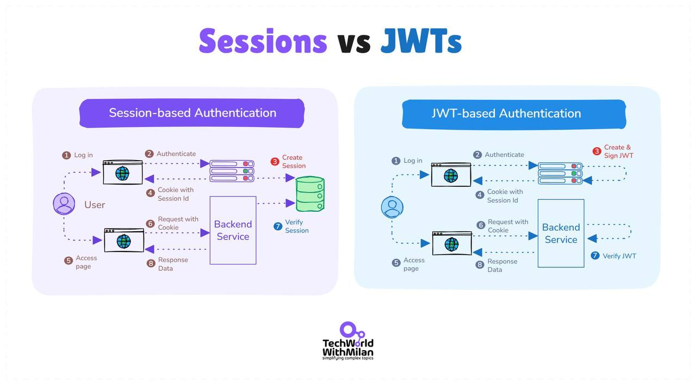

### Общая информация по безопасности

#### Аутентификация

**Аутентификация на основе сессий**
Когда пользователь входит в систему, бэкенд генерирует случайный session ID, сохраняет его в кэше или базе данных и устанавливает этот ID как HttpOnly cookie в браузере. При каждом запросе браузер отправляет cookie, сервер находит соответствующую запись и восстанавливает пользовательский контекст.
Такой подход:
- сохраняет чувствительные данные на сервере.
- позволяет мгновенно завершить сессию удалением записи.

**Преимущества**
- Мгновенная деактивация доступа (“выйти отовсюду”) - одной строкой: просто удалить запись из Redis или SQL.
- Секреты никогда не покидают сервер, что снижает риск утечки.
- Отлично подходит для малых и средних систем, где кэш - не узкое место.

**Недостатки**
При горизонтальном масштабировании понадобятся «липкие» сессии или реплицированный кэш, что добавляет задержки и усложняет инфраструктуру.

**Вывод**
Если главное - возможность немедленно отозвать доступ, выбирай сессии.

**Аутентификация с помощью JWT (JSON Web Token)**
После входа сервер подписывает JWT, содержащий:
- заголовок (например, alg, typ),
- полезную нагрузку (claims - sub, role и т.д.),
- цифровую подпись.

JWT - это просто base64-строка (не шифрованная): любой может прочитать данные, но подделать их может только владелец секрета. Сервер не хранит состояние - любой узел может локально проверить подпись и доверять данным.

**Преимущества**
- Беспамятный (stateless): не требует общего хранилища, подходит для микросервисов и edge-нод.
- Удобен для SPA и мобильных приложений, напрямую работающих с бэкендами.
- Лёгкий: помещается в заголовок Authorization или cookie.

**Недостатки**
JWT нельзя отозвать после выдачи - он действителен до истечения срока, так что «экстренный выход» или блокировка аккаунта требуют дополнительной логики.

**Вывод**
Если нужна масштабируемость без состояния, выбирай JWT, но помни, что токены нельзя «забрать обратно» после их выдачи.
