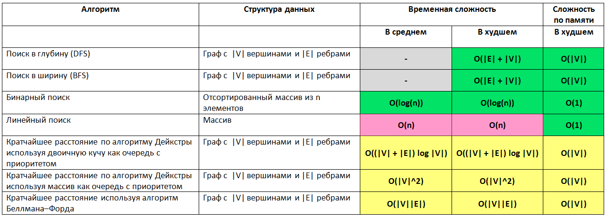
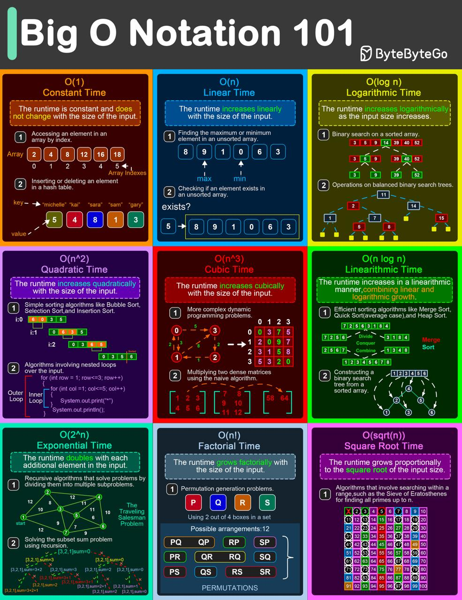

### 2.1.1 Сложность алгоритма

**Нотация асимптотического роста**

-  **(О — большое)**
        верхняя граница, в то время как (Омега — большое) — нижняя граница. Тета требует как (О — большое), так и (Омега — большое), поэтому она является точной оценкой (она должна быть ограничена как сверху, так и снизу). К примеру, алгоритм требующий Ω (n logn) требует не менее n logn времени, но верхняя граница не известна. Алгоритм требующий Θ (n logn) предпочтительнее потому, что он требует не менее n logn (Ω (n logn)) и не более чем n logn (O(n logn)).

-  **f(x)=Θ(g(n))**
        означает, что f растет так же как и g когда n стремится к бесконечности. Другими словами, скорость роста f(x) асимптотически пропорциональна скорости роста g(n).

-   **f(x)=O(g(n))**
       Здесь темпы роста не быстрее, чем g (n). O большое является наиболее полезной, поскольку представляет наихудший случай.
**Мышление в терминах Big O**
    - Получение элемента коллекции это O(1). Будь то получение по индексу в массиве, или по ключу в словаре в нотации Big O это будет O(1)
    - Перебор коллекции это O(n)
    - Вложенные циклы по той же коллекции это O(n^2)
    - Разделяй и властвуй (Divide and Conquer) всегда O(log n)
    - Итерации которые используют Divide and Conquer это O(n log n)

**График роста O — большое**

**O(1) — Константное время**
- Время выполнения не зависит от размера входных данных.
- Пример: доступ к элементу массива по индексу.

**O(log n) — Логарифмическое время**
- Время выполнения растёт медленно при увеличении размера входных данных. Обычно встречается в алгоритмах, которые на каждом шаге делят задачу пополам.
- Пример: бинарный поиск в отсортированном массиве.

**O(n) — Линейное время**
- Время выполнения растёт прямо пропорционально размеру входных данных.
- Пример: поиск элемента в массиве перебором всех элементов.

**O(n log n) — Линейно-логарифмическое время**
- Время выполнения растёт чуть быстрее линейного, включает логарифмическое число операций для каждого элемента.
- Пример: сортировка массива быстрой сортировкой или сортировкой слиянием.

**O(n²) — Квадратичное время**
- Время выполнения пропорционально квадрату размера входных данных.
- Пример: сортировка пузырьком, где сравниваются и при необходимости меняются местами все пары элементов.

**O(2ⁿ) — Экспоненциальное время**
- Время выполнения удваивается с каждым новым элементом во входных данных. Такие алгоритмы становятся непрактичными для больших входных размеров.
- Пример: генерация всех подмножеств множества.

**O(n!) — Факториальное время**
- Время выполнения пропорционально факториалу размера входных данных.
- Пример: генерация всех перестановок множества.

**Поиск**

**Сортировка**

**Структуры данных**

**Кучи**

**Представление графов**
Пусть дан граф с |V| вершинами и |E| ребрами, тогда

