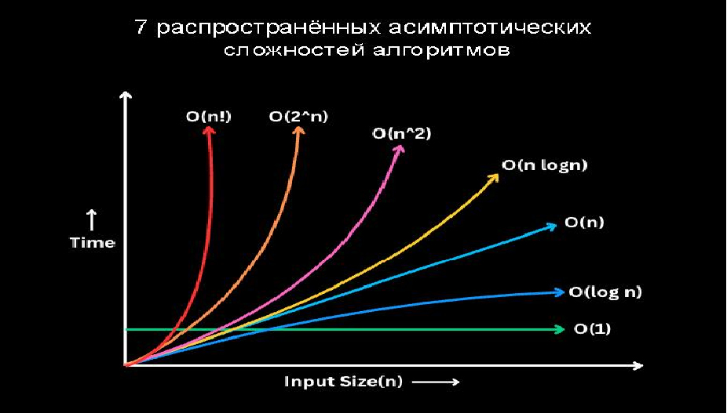

### 2.1.1 Сложность алгоритма

**Нотация асимптотического роста**

-  **(О — большое)**
        верхняя граница, в то время как (Омега — большое) — нижняя граница. Тета требует как (О — большое), так и (Омега — большое), поэтому она является точной оценкой (она должна быть ограничена как сверху, так и снизу). К примеру, алгоритм требующий Ω (n logn) требует не менее n logn времени, но верхняя граница не известна. Алгоритм требующий Θ (n logn) предпочтительнее потому, что он требует не менее n logn (Ω (n logn)) и не более чем n logn (O(n logn)).

-  **f(x)=Θ(g(n))**
        означает, что f растет так же как и g когда n стремится к бесконечности. Другими словами, скорость роста f(x) асимптотически пропорциональна скорости роста g(n).

-   **f(x)=O(g(n))**
       Здесь темпы роста не быстрее, чем g (n). O большое является наиболее полезной, поскольку представляет наихудший случай.
**Мышление в терминах Big O**
    - Получение элемента коллекции это O(1). Будь то получение по индексу в массиве, или по ключу в словаре в нотации Big O это будет O(1)
    - Перебор коллекции это O(n)
    - Вложенные циклы по той же коллекции это O(n^2)
    - Разделяй и властвуй (Divide and Conquer) всегда O(log n)
    - Итерации которые используют Divide and Conquer это O(n log n)

**График роста O — большое**

**Поиск**

**Сортировка**

**Структуры данных**

**Кучи**

**Представление графов**
Пусть дан граф с |V| вершинами и |E| ребрами, тогда

