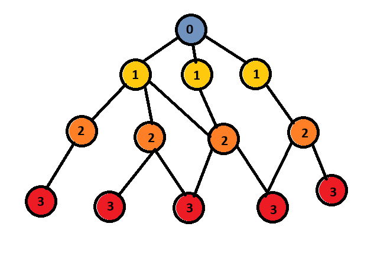
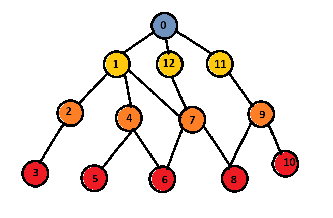
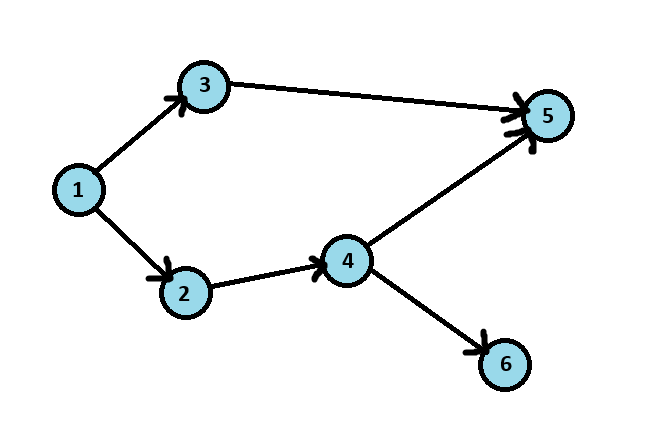
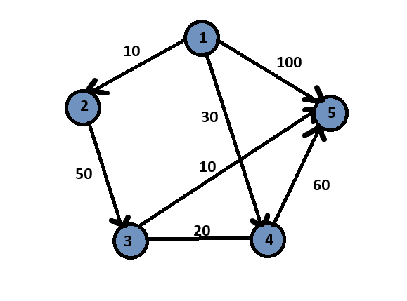

### Алгоритмы при работе с графами

#### BFS — поиск в ширину
**BFS (Breadth‑First Search)** — базовый алгоритм обхода графа, который последовательно расширяет очередь посещённых вершин, двигаясь слоями: сначала все соседи начальной вершины, затем их соседи, затем следующие уровни и так далее.

Главная идея: равномерно исследовать граф от точки старта, не углубляясь в одну ветку.
 ~~Пример работы BFS (начало 0 — потом 1, 1, 1 — 2,2,2,2 — 3,3,3,3,3)~~

**Принцип работы**
BFS опирается на очередь (простая структура данных, которая работает по принципу первым пришёл — первым обслужен).
**Алгоритм в трёх шагах:**
1. Поместить стартовую вершину в очередь.
2. Пока очередь не пуста — извлечь вершину, обработать её и добавить всех непосещённых соседей.
3. Пометить каждую посещённую вершину, чтобы избежать повторов.

Этот механизм гарантирует, что мы посещаем вершины в порядке увеличения расстояния от старта.

```C++
vector<vector<int>> g;      // граф
vector<bool> used;          // флаг посещения
vector<int> dist;           // расстояние от старта

void bfs(int start) {
    queue<int> q; // очередь
    q.push(start); // добавляем 0 вершину 
    used[start] = true; // посетили вершину
    dist[start] = 0; // расстояние от старта до старта - 0

    while (!q.empty()) {
        int v = q.front(); // берем вершину
        q.pop(); // удаляем из очереди

        for (int to : g[v]) { // рассматриваем соседей
            if (!used[to]) { // если не посещен
                used[to] = true; // посещаем
                dist[to] = dist[v] + 1; // длина от старта до данной вершины
                q.push(to); // добавляем в очередь
            }
        }
    }
}
```
**Примечание**
Алгоритм BFS работает только на невзвешенных графах. Для них существует иной алгоритм — Дейкстры.
- Время: O(V + E) V — вершина, E — ребро
- Память: O(V), V — вершина

**Где применяется**

1. **Кратчайший путь в невзвешенных графах** Лабиринты, сетки, карты, любые структуры, где стоимость перехода одинакова.

2. **Поиск расстояний и уровней в графе** Построение слоёв, вычисление расстояния от истока до всех вершин.

3. **Проверка связности** Определение, находится ли граф в одной компоненте; поиск компонент.

4. **Восстановление кратчайшего маршрута** BFS даёт дерево предков — по нему можно легко собрать путь.

5. **Поиск минимального количества шагов/действий** Задачи вида «из состояния А получить состояние B минимальными операциями».

6. **Поиск в ширину в деревьях** Для вычисления глубины, диаметра, уровневых свойств.

#### DFS — поиск в глубину

**DFS (Depth‑First Search)** — классический алгоритм обхода графа, который углубляется максимально далеко по одному направлению, пока это возможно, и только потом возвращается назад. В отличие от BFS, который исследует граф слоями, DFS следует по пути до упора, словно «погружаясь» в структуру графа.
Главная идея: идти в глубину, пока можно, потом откатываться назад, и снова идти в глубину.
 ~~Пример работы DFS (1-2-3-2-1-4-5-4-6-7-8-9-10-9-11-9-8-7-12)~~

**Принцип работы**

DFS опирается на стек (структура данных с принципом последний пришёл — первый обслужен).
Именно он задаёт глубинное поведение алгоритма.
Классическая рекурсивная версия использует стек вызовов языка, поэтому выглядит особенно лаконично.

**Алгоритм в трёх шагах:**
1. Войти в вершину и пометить её как посещённую.
2. Рекурсивно вызвать DFS для каждого непосещённого соседа.
3. После обработки всех соседей — автоматически вернуться назад по стеку.

Такой механизм формирует глубинный обход: мы не рассматриваем другие ветви, пока не исследуем текущую до конца.

```C++
vector<vector<int>> g;     // граф
vector<bool> used;         // флаг посещения

void dfs(int v) {
    used[v] = true; // посещаем вершину

    for (int to : g[v]) { // рассматриваем соседей
        if (!used[to]) { // если не был посешен
            dfs(to); // "опускаемся" в данную вершину
        }
    }
}
```
- Время:O(V + E), V — вершина, E — ребро
- Память: O(V), V — вершина

**Где применяется**

1. **Обход компонент связности**. Естественный способ найти все компоненты.
2. **Обнаружение циклов**. Во всех типах графов: ориентированные/неориентированные.
3. **Топологическая сортировка**. DFS‑версия — основа классического алгоритма.
4. **Анализ структуры графа**. Поиск мостов, точек сочленения, компонент сильной связности.
5. **Генерация путей, перебор и «backtracking»**. Поиск комбинаций, разбор деревьев вариантов, решения рекурсивных задач.

#### Топологическая сортировка

**Топологическая сортировка** — это упорядочивание вершин ориентированного графа так, чтобы каждое ребро u → v шло от более ранней вершины к более поздней.
Иначе говоря, если вершина v зависит от u, то в порядке прохождения u всегда стоит перед v.

Топологическая сортировка возможна только для направленных ациклических графов (DAG). Если в графе есть цикл, корректного топологического порядка не существует.

 ~~Возможные результаты топ.сорт.: 1-2-4-6-3-5; 1-3-2-4-5-6; 1-3-2-4-6-5~~

**Принцип работы (DFS-версия)**
При обходе DFS каждая вершина добавляется в список только тогда, когда полностью обработаны все вершины, достижимые по её исходящим рёбрам.
Поэтому если существует ребро u → v, то вершина v всегда окажется в списке раньше u.
Именно поэтому итоговый порядок получается «обратным» и его нужно развернуть.
Это и обеспечивает корректность топологической сортировки через DFS.

**Алгоритм:**
1. Запускаем DFS из каждой непосещённой вершины.
2. Рекурсивно обрабатываем все исходящие рёбра текущей вершины.
3. Когда все вершины, в которые из неё есть рёбра, уже обработаны — добавляем текущую вершину в конец списка.
4. После завершения обхода всех вершин — разворачиваем список и получаем искомый порядок.

```C++
vector<vector<int>> g;     // граф
vector<bool> used;         // флаг посещения
vector<int> order;         // итоговый порядок

void dfs(int v) {
    used[v] = true; 

    for (int to : g[v]) {
        if (!used[to]) { 
            dfs(to); 
        }
    }
    order.push_back(v);    // добавляем после обработки всех "детей"
}

vector<int> top_sort(int n) { // n — количество вершин
    used.assign(n, false); // обнуляем массив посещений
    order.clear();

    for (int v = 0; v < n; v++) {   // для каждой вершины
        if (!used[v])               // если ещё не посещена
            dfs(v);                 // запускаем обход в глубину
    }

    reverse(order.begin(), order.end()); // разворачиваем и получаем результат
    return order;
}
```

- Время:O(V + E), V — вершина, E — ребро
- Память: O(V), V — вершина

**Примечание**
Алгоритм корректен только для ациклических ориентированных графов.
Если в графе есть цикл, DFS‑версия всё равно выдаст результат, но он не будет топологически корректным. Для обнаружения циклов используют дополнительный массив color[] (0/1/2).

**Где применяется**

1. **Разрешение зависимостей**. Сборка проектов, зависимости в пакетных менеджерах, планирование задач.
2. **Порядок вычисления формул/операторов**. Алгебраические цепочки, зависимые вычисления.
3. **Планирование процессов без циклов**. Производственные цепочки, workflow‑системы, задания в DAG.
4. **Проверка наличия цикла**. Если топ.сорт. не существует — граф цикличен.
5. **Линейное упорядочивание событий при условии «если A → B — A раньше B»**. Используется в компиляции, оптимизациях, анализе программ.

#### Алгоритм Дейкстры

**Алгоритм Дейкстры** — классический метод поиска кратчайших путей во взвешенном графе с **неотрицательными рёбрами.**
Он вычисляет минимальную стоимость пути от стартовой вершины до всех остальных и формирует корректное дерево кратчайших путей.
**Ключевая идея:**
Мы всегда выбираем ближайшую по текущим расстояниям непосещённую вершину. Поскольку веса рёбер неотрицательные, её расстояние уже невозможно улучшить — оно становится окончательным.



**Наивная версия алгоритма (O(V²))**
**Алгоритм:**
1. Инициализируем расстояния: start = 0, остальные = ∞.
2. Повторяем V раз:
        - выбираем среди всех непосещённых вершину с минимальным расстоянием;
        - «фиксируем» её — расстояние окончательное;
        - пытаемся улучшить расстояния до всех её соседей.

```C++
vector<vector<pair<int,int>>> g;  // граф: (куда, вес)
vector<long long> dist;           // расстояния от старта
vector<bool> used;                // флаг "вершина уже обработана"
const long long INF = 1e18;       // бесконечность

void dijkstra_naive(int start) {
    int n = g.size();
    dist.assign(n, INF);  // изначально все расстояния бесконечны
    used.assign(n, false); // все вершины не обработаны

    dist[start] = 0; // расстояние до старта — 0

    for (int it = 0; it < n; it++) { // делаем n итераций
        int v = -1;

        // ищем непосещённую вершину с минимальным расстоянием
        for (int i = 0; i < n; i++) {
            if (!used[i] && (v == -1 || dist[i] < dist[v])) {
                v = i;
            }
        }

        if (v == -1 || dist[v] == INF)
            break; // подходящих вершин больше нет

        used[v] = true; // фиксируем вершину: её расстояние окончательное

        // пытаемся улучшить расстояния до соседей
        for (auto [to, w] : g[v]) {
            if (dist[v] + w < dist[to]) {
                dist[to] = dist[v] + w; // обновляем, если нашли путь короче
            }
        }
    }
}
```
- Время: O(V²), V— вершина
- Память: O(V), V — вершина

#### Алгоритм Дейкстры.Оптимизированная версия с приоритетной очередью
Чтобы быстрее находить вершину с минимальным расстоянием, используют приоритетную очередь. Это снижает время работы с квадратичного до почти линейного.

**Алгоритм:**
Инициализируем расстояния: start = 0, остальные = ∞.
1. Кладём старт в приоритетную очередь.
2. Пока очередь не пуста:
    - извлекаем вершину с минимальной текущей дистанцией;
    - если значение устарело — пропускаем;
    - пытаемся улучшить расстояния до всех соседей;
    - при улучшении кладём соседа в очередь.

```C++
vector<vector<pair<int,int>>> g;  // список смежности: (куда, вес)
vector<long long> dist;
const long long INF = 1e18;

void dijkstra(int start) {
    int n = g.size();
    dist.assign(n, INF); // изначально расстояния бесконечны

    // приоритетная очередь: (расстояние, вершина)
    // вершина с наименьшим расстоянием обрабатывается первой
    priority_queue<pair<long long,int>,
                   vector<pair<long long,int>>,
                   greater<pair<long long,int>>> pq;

    dist[start] = 0;               // расстояние до старта — 0
    pq.push({0, start});           // помещаем старт в очередь

    while (!pq.empty()) {
        auto [d, v] = pq.top();    // достаём вершину с минимальной дистанцией
        pq.pop();

        if (d != dist[v]) continue; // пропускаем устаревшую запись


        for (auto [to, w] : g[v]) {
            if (dist[v] + w < dist[to]) { // найден более короткий путь
                dist[to] = dist[v] + w;   // улучшаем расстояние
                pq.push({dist[to], to});  // кладём обновлённую вершину в очередь
            }
        }
    }
}
```

**Примечание** Алгоритм Дейкстры корректно работает только если все веса рёбер неотрицательные.

- Время:O((V + E) * logE) , V — вершина, E — ребро
- Память: O(V), V — вершина

**Где применяется**
1. **Кратчайший путь в графах с неотрицательными весами**. Навигация, логистические задачи, карта дорог, внутриигровой AI pathfinding.
2. **Сетевые алгоритмы**. Маршрутизация трафика: основа протокола OSPF.
3. **Анализ стоимости переходов между состояниями**. В задачах на графах состояний, динамическом программировании на графе.
4. **Оптимизация расхода ресурсов**. Минимизация времени, энергии, стоимости переходов.
5. **Поиск оптимальных маршрутов в реальном времени**. GPS, транспортные схемы, робототехника.
6. **Решение задач «минимальный путь при разных весах ребер»**. Все, что выходит за рамки BFS.