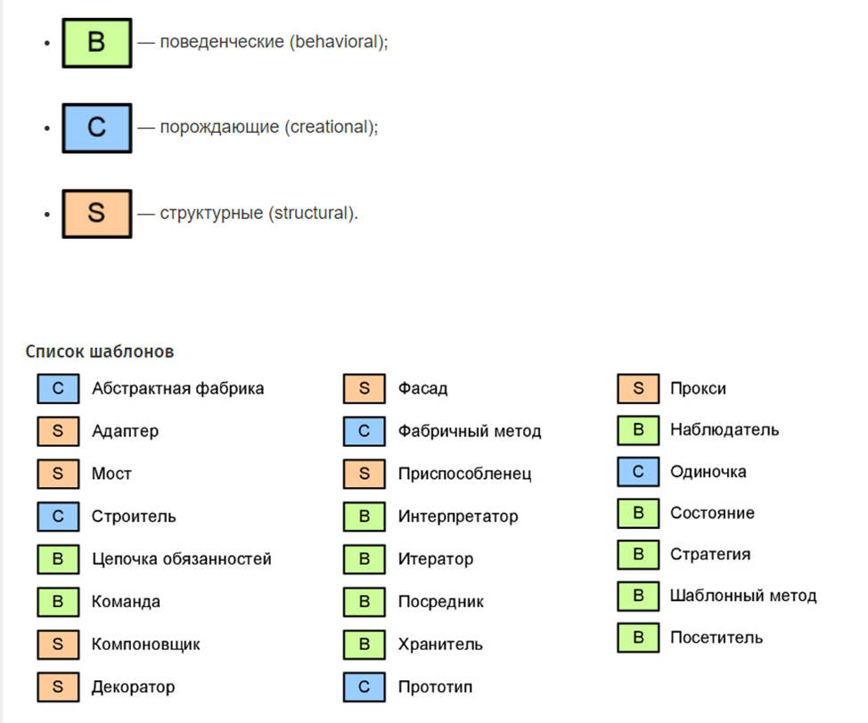

### GRASP (General Responsibility Assignment Software Patterns)

Шаблоны для назначения главных ответственностей; также отсылает к англ. grasp — «способность быстрого восприятия, понимание, схватывание») — шаблоны, используемые в объектно-ориентированном проектировании для решения общих задач по назначению ответственностей классам и объектам. 

- **Информационный эксперт (Information Expert)** Информация должна обрабатываться там, где она содержится.
- **Создатель (Creator)**  Создавать экземпляры класса должен класс, которому они нужны. 
- **Контроллер (Controller)** Выносим логику многопоточности в отдельный класс или компонент. 
- **Слабое (низкое) зацепление (Low Coupling)** Необходимо распределить ответственности между классами так, чтобы обеспечить минимальную связанность.
- **Сильная (высокая) связность (High Cohesion)** Классы должны содержать связанную бизнес — логику.
- **Полиморфизм (Polymorphism)** Различные варианты поведения системы при необходимости оформляем в виде полиморфных вызовов.
- **Чистая выдумка (Pure Fabrication)** Не стесняемся создавать классы, не имеющие аналог в предметной области, если это необходимо для соблюдения Low Coupling и High Cohesion.
- **Перенаправление (Indirection)** Необходимо распределить обязанности между объектами, избежав прямого связывания. Для этого можно присвоить обязанности по обеспечению связи между компонентами или службами промежуточному объекту. Любой класс вызываем через его интерфейс. 
- **Устойчивость к изменениям (Protected Variations)** Необходимо спроектировать систему так, чтобы изменение одних ее элементов не влияло на другие. В качестве решения предлагается идентифицировать точки возмоджных изменений или неустойчивости и распределить обязанности таким образом, чтобы обеспечить устойчивую работу системы.

