### 2.3.1 Паттерны проектирования микросервисов
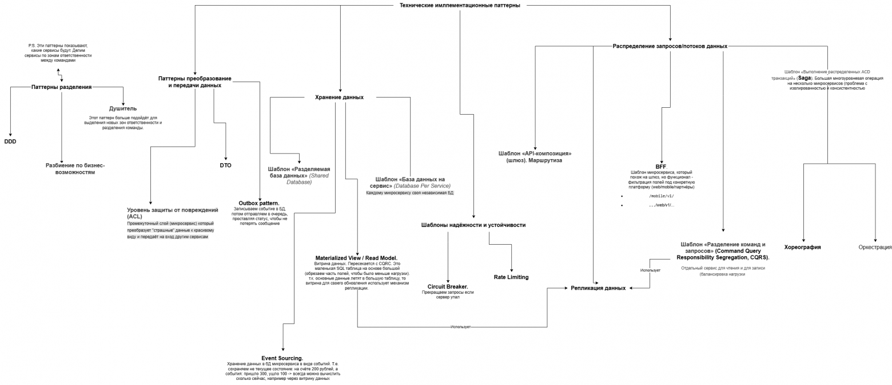
#### Паттерны декомпозиции на микросервисы
**Шаблон «Разбиение по бизнес-возможностям» (Decompose By Business Capability)**
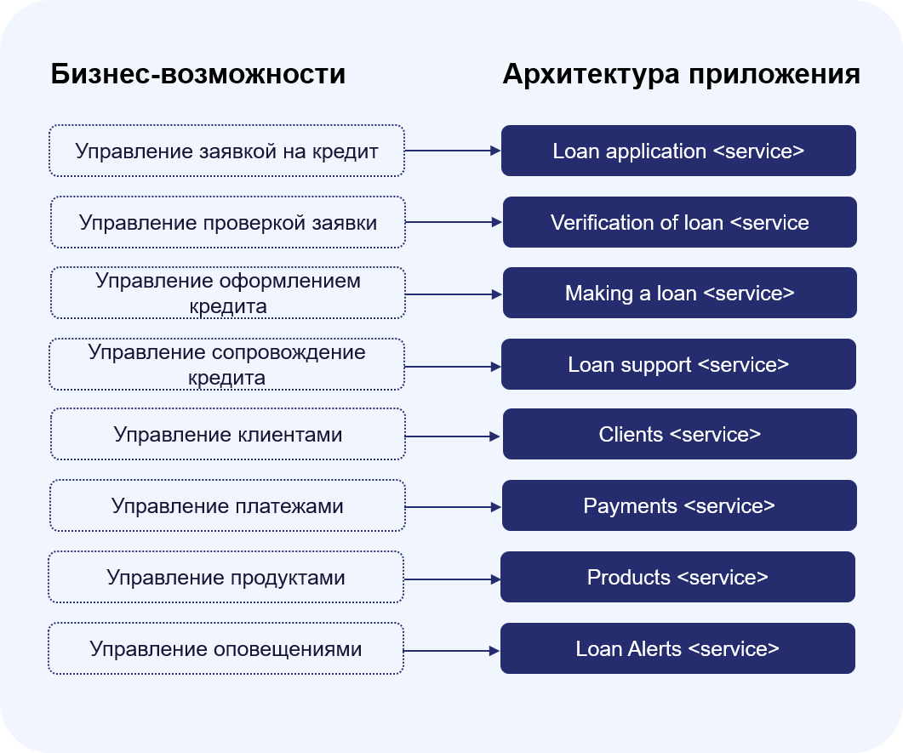
Один из наиболее известных способов разбиения на микросервисы — это определение бизнес-возможностей приложения и создание по одному микросервису на каждую из них.
Бизнес-возможности представляют собой функции, которые будут доступны пользователям при работе с приложением.

**Шаблон «Разбиение по поддоменам» (Domain-Driven Design, DDD)**
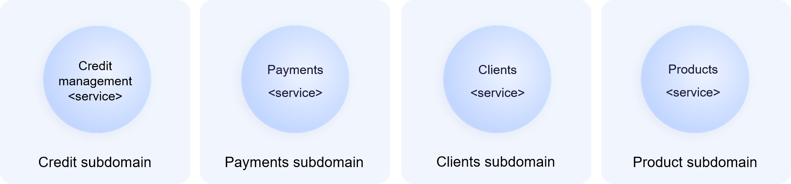
DDD разбивает всю модель предметной области (домен) на поддомены. У каждого поддомена своя модель данных, область действия которой принято называть ограниченным контекстом (Bounded Context). Каждый микросервис будет разрабатываться внутри этого ограниченного контекста.
Основная задача при использовании DDD-подхода — подобрать поддомены и границы между ними так, чтобы они были максимально независимы друг от друга.

#### Паттерны рефакторинга для перехода на микросервисы
**Шаблон «Душитель» (Strangler)**
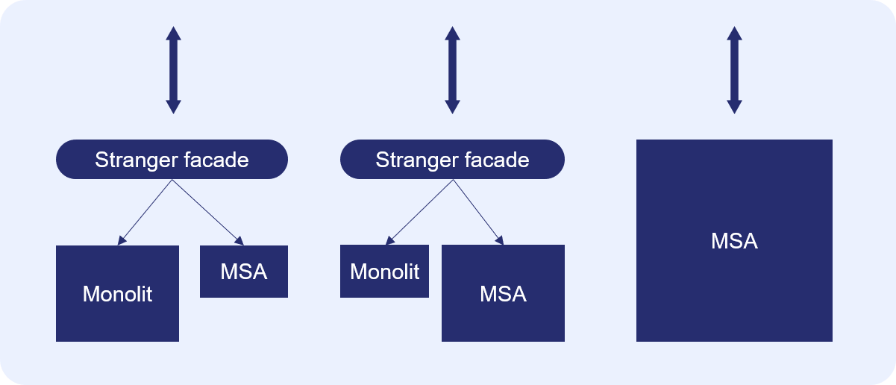
Этот шаблон означает миграцию монолитного приложения на микросервисную архитектуру путем постепенного переноса существующих функций в микросервисы. Настраивается маршрутизация запросов между устаревшим монолитом и микросервисами.
Когда очередная функциональность переносится из монолита в микросервисы, фасад перехватывает клиентский запрос и направляет его к микросервисам.

**Шаблон «Уровень защиты от повреждений» (Anti-Corruption Layer)**
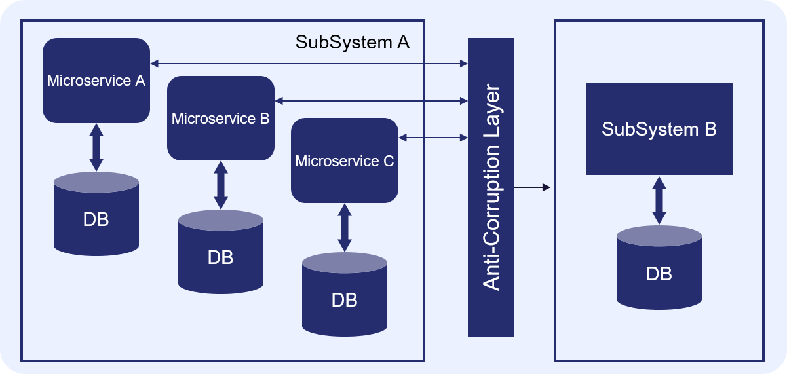
Шаблон позволяет изолировать разные подсистемы, поместив между ними уровень защиты от повреждений. Этот уровень преобразует обмен данными между двумя системами, за счет чего одна система не изменяется, а в другой сохраняется структура и технологический подход.

#### Паттерны управления данными в микросервисной архитектуре

**Шаблон «База данных на сервис» (Database Per Service)**
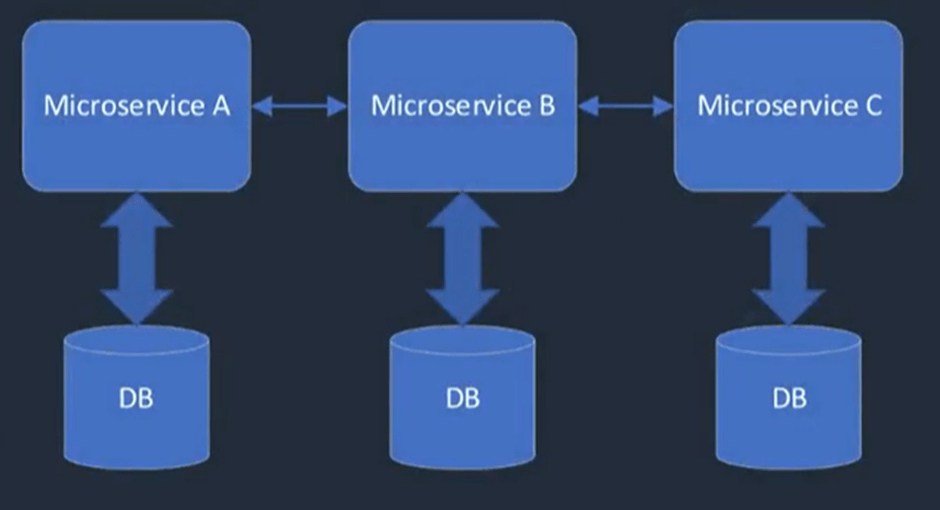
Этот паттерн предлагает дать каждому микросервису свое собственное хранилище данных. Так мы сможем избежать сильных зависимостей между сервисами на уровне данных и обеспечить их автономность. Обращаю внимание, что речь идет о логическом разделении данных. Физически микросервисы могут использовать одну и ту же базу данных, но в ней они должны работать с отдельными схемами, коллекциями или таблицами. Этот шаблон дает большую автономность микросервисам и уменьшает связь между командами разработки, которые занимаются отдельными сервисами. Например, сервис управления клиентами получит доступ только к таблице clients, а сервис управления товарами — только к таблице products, даже если физически обе таблицы лежат в одной базе.

**Шаблон «Разделяемая база данных» (Shared Database).** 
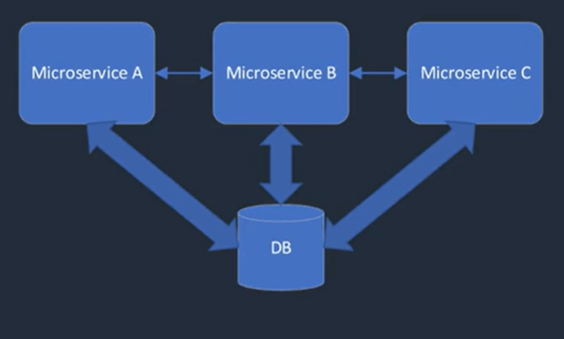
По сути, это антипаттерн, он разрешает использовать одну базу данных для нескольких микросервисов. Это, конечно, противоречит принципу автономности микросервисов и может привести к сильной связанности между ними. Такой шаблон подойдет только на начальных этапах миграции или в очень маленьких проектах, где все микросервисы (не больше 2-3 штук) делает одна команда. Но проект растет, микросервисов становится больше, и тогда использовать разделяемую базу уже проблематично, это может снизить производительность, усложнить разработку и масштабирование. И в результате мы получим не микросервисную архитектуру, а распределенный монолит. Поэтому в большинстве случаев нужно стремиться к паттерну «База данных на сервис», он даст максимальную автономность и гибкость микросервисной архитектуры.

**Шаблон «API-композиция» (API Composition)**
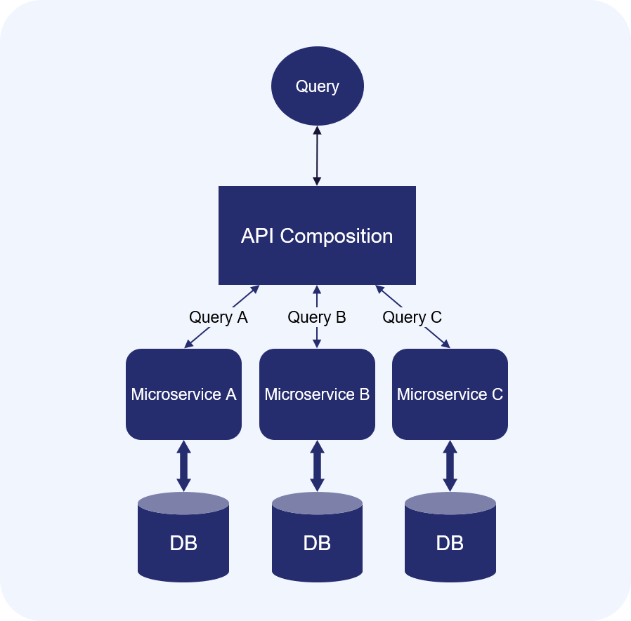
Этот шаблон является одним из возможных вариантов получения данных из нескольких сервисов после применения к ним паттерна Database Per Service.
Он предлагает создать отдельное API, которое будет вызывать необходимые сервисы, владеющие данными, и выполнять соединение полученных от них результатов в памяти.
Паттерн можно рассматривать как вариант использования другого шаблона — API Gateway, о котором мы поговорим ниже.

**Шаблон «Разделение команд и запросов» (Command Query Responsibility Segregation, CQRS)**
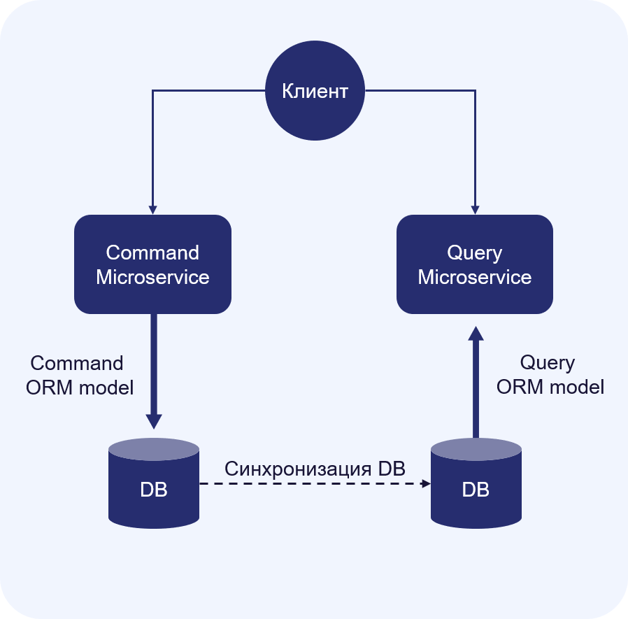
Этот паттерн предлагает отделить изменение данных (Command) от чтения данных (Query). Шаблон CQRS имеет две формы: простую и расширенную.
В простой форме для чтения и записи используются отдельные модели ORM (Object-Relational Mapping), но общее хранилище данных.

**Шаблон «Выполнение распределенных транзакций» (Saga)**
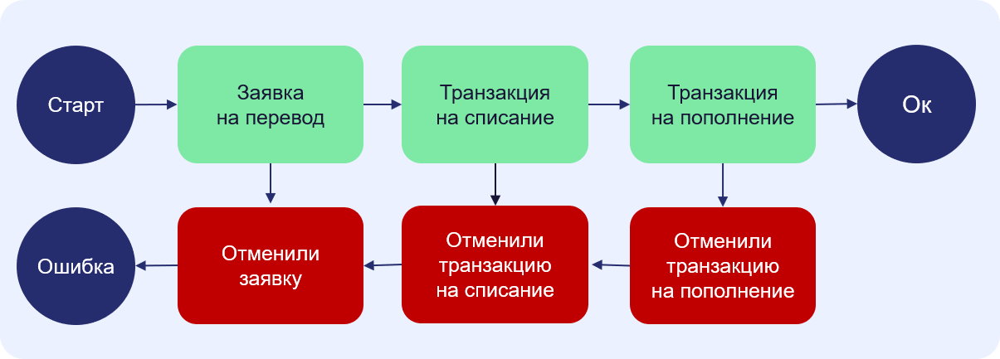
Паттерн Saga предлагает надежное решение для работы с распределенными транзакциями, обеспечивая согласованность данных при сохранении автономии ваших сервисов.
При использовании паттерна каждая локальная транзакция обновляет данные в хранилище в рамках одного микросервиса и публикует событие или сообщение, которые, в свою очередь, запускают следующую локальную транзакцию и так далее. Если локальная транзакция завершается с ошибкой, выполняется серия компенсирующих транзакций, которые отменяют изменения предыдущих транзакций.

*ОРКЕСТРОВКА*
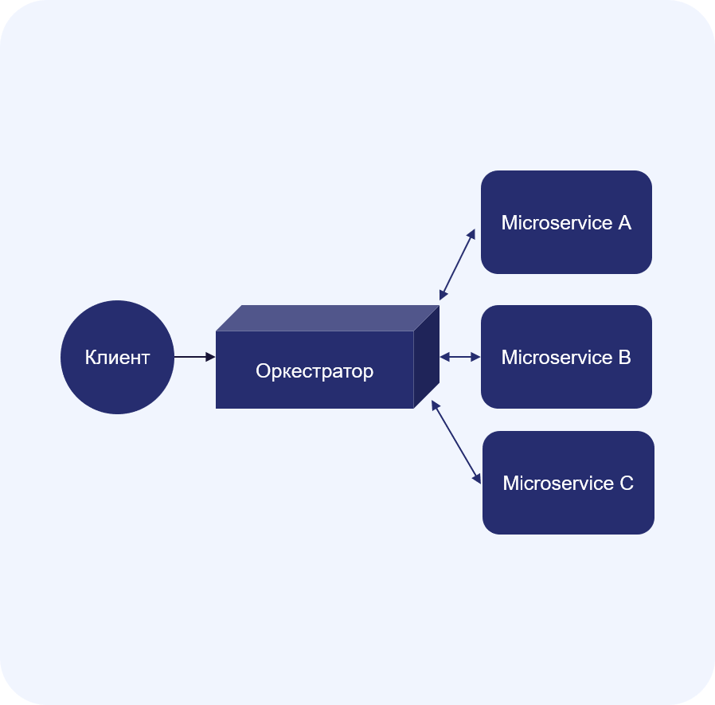
Централизованная координация, при которой отдельный компонент (оркестратор) сообщает микросервисам, какое действие необходимо выполнить далее.

*ХОРЕОГРАФИЯ*
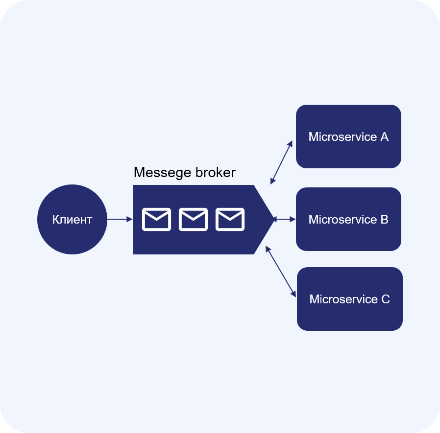
Децентрализованная координация, при которой каждый микросервис прослушивает события / сообщения другого микросервиса и решает, следует предпринять действие или нет.

#### Паттерны коммуникации микросервисов
**Шаблон «API-шлюз» (API Gateway)**
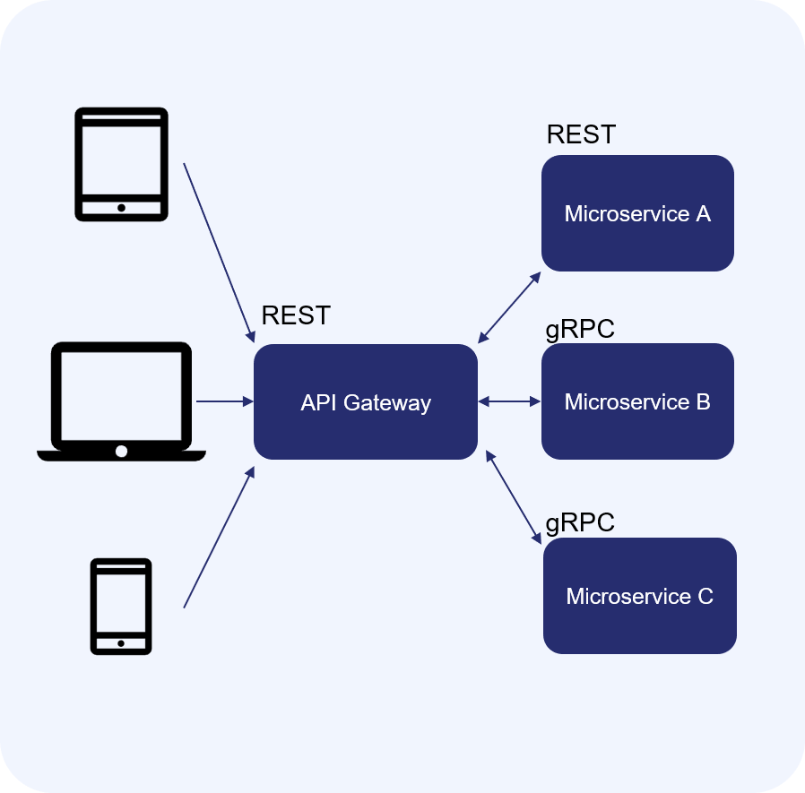
Этот паттерн основан на применении шлюза, который находится между клиентским приложением и микросервисами, обеспечивая единую точку входа для клиента.
Выступая в качестве единой точки входа для всех клиентских запросов, API-шлюз упрощает доступ к вашим микросервисам, обеспечивая бесшовное взаимодействие между клиентами и сервисами.

**Шаблон «Бэкенды для фронтендов» (Backends for Frontends, BFF)**
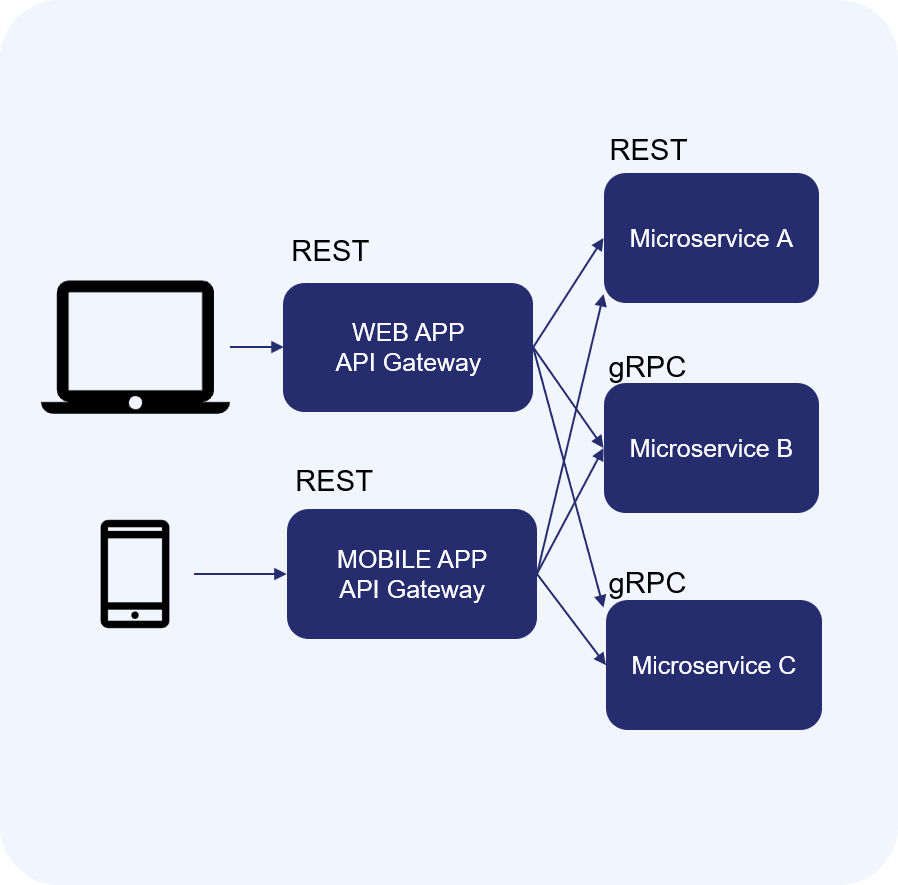
Этот паттерн является вариантом реализации шаблона API Gateway. Он также обеспечивает дополнительный уровень между микросервисами и клиентами, но вместо одной точки входа вводит несколько шлюзов для каждого типа клиента: Web, Mobile, Desktop и так далее.

Такой подход удобен, когда планшеты, компьютеры или мобильные телефоны требуют разные данные. Но как выбирать между стандартным API Gateway и BFF? 

Если контракты для всех устройств похожи или вовсе идентичны, нет смысла создавать отдельный шлюз для каждого типа устройства. Ведь это приведет к ненужной работе и дублированию кода. В итоге у вас получится два API, которые передают одни и те же данные. Поэтому, если нет значительных отличий в контрактах или данных, требуемых разными устройствами, не усложняйте систему созданием нескольких шлюзов.

Но если данные действительно разнятся, например, половина контракта актуальна для мобильных устройств, а остальное — для веб-версии, стоит задуматься о разделении контрактов под каждое устройство. Это позволит оптимизировать работу и избежать передачи лишних данных. Нужно лишь хорошенько взвесить все «за» и «против», прежде чем приступать к такому разделению.

Переходим к следующим паттернам, связанным с построением пользовательского интерфейса. Я объединил на одной схеме два паттерна, которые сейчас популярны в разработке UI.

#### Паттерны построения пользовательского интерфейса
**Шаблон «Client-Side UI Composition» и «Server-Side Page Fragment Composition»**
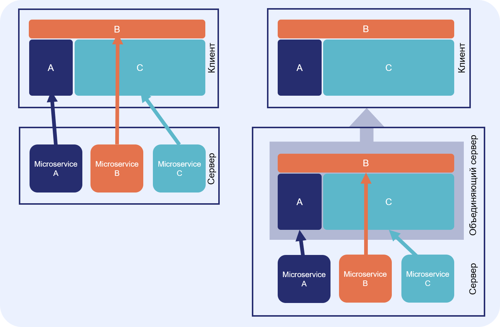
Как реализовать экран или страницу пользовательского интерфейса, отображающую данные из нескольких служб.
*Существуют два основных подхода к сборке пользовательских интерфейсов*
Первый подход — сборка на стороне клиента. В этом случае интерфейс собирается непосредственно на клиенте. Для реализации этого подхода часто используются фронтенд-фреймворки, такие как Angular.js или React.js. Эти инструменты позволяют динамически подгружать отдельные блоки данных, что особенно полезно, если каждый блок обслуживается отдельным микросервисом. Это позволяет оптимизировать загрузку страниц, разбивая её на части и избегая передачи большого объема данных сразу.

Когда UI становится сложным, а объем передаваемых данных велик, имеет смысл разделить страницу на несколько блоков (например, A, B и C). Каждый такой блок может получать свои данные от соответствующего микросервиса. При таком подходе клиентская сторона самостоятельно обращается к различным сервисам для получения необходимых данных. 

Другой подход — сборка на стороне сервера. Здесь сервер выступает в роли шлюза, собирая данные из различных микросервисов, формируя страницу целиком и затем отправляя её клиенту в готовом виде. Примером инструмента, который может выполнять такую функцию, является Varnish или Nginx. Этот метод подходит для случаев, когда UI относительно прост и передача всех данных сразу не вызывает значительных задержек.

Таким образом, выбор между этими двумя паттернами зависит от сложности интерфейса и особенностей используемой микросервисной архитектуры. Аналитик должен понимать эти принципы, чтобы эффективно участвовать в проектировании системы и учитывать возможные варианты реализации. 

Теперь перейдем к следующему важному паттерну, который помогает избежать каскадных отказов в системе

#### Паттерны повышения отказоустойчивости
**Шаблон «Защита от каскадных сбоев» (Circuit Breaker)**
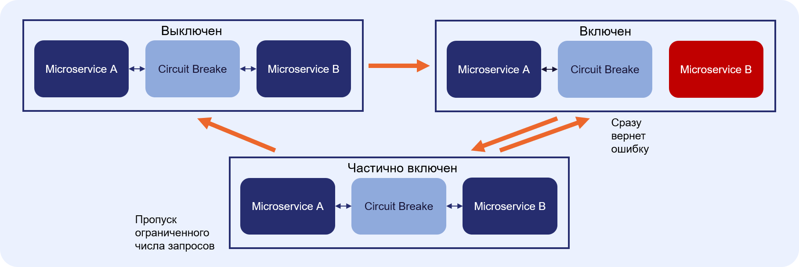
Шаблон Circuit Breaker отслеживает сбои и предотвращает достижение запросов до неработающего сервиса, давая ему время для восстановления и защищая всю систему от полного отказа.

Как системные аналитики, участвующие в проектировании, мы должны учитывать, что в микросервисной архитектуре может применяться такая защита — паттерн предотвращения каскадных сбоев.

Что это значит? Проблема заключается в следующем: если микросервис выходит из строя, попытки обращения к нему только усугубляют ситуацию, мешая восстановлению. Чтобы избежать окончательного сбоя, применяется паттерн Circuit Breaker. Эта прослойка контролирует работу микросервиса. Пока всё работает нормально, запросы от одного микросервиса беспрепятственно доходят до другого. Однако, если количество ошибок достигает определённого порога (что задаётся в настройках Circuit Breaker), система определяет, что с сервисом возникли проблемы, и мгновенно возвращает ошибку запрашивающему микросервису, не передавая запрос дальше. Таким образом, неисправный микросервис получает шанс на восстановление, поскольку новые запросы к нему временно прекращаются.

Circuit Breaker периодически проверяет состояние микросервиса. Если микросервис начинает отвечать корректно, он позволяет проходить обычным запросам. Если же микросервис всё ещё не функционирует должным образом, Circuit Breaker возвращается в режим блокировки, продолжая защищать систему от перегрузки. 

Часто механизм Circuit Breaker уже используется в IT ландшафте в который мы встраиваемся. Тем не менее, если подобная защита отсутствует, нам придётся самостоятельно реализовывать меры против каскадных сбоев. Как системным аналитикам, нам необходимо убедиться, что в нашей архитектуре предусмотрена защита от каскадных сбоев. Если её нет, нам следует подумать над тем, как её внедрить. 

#### Паттерны мониторинга микросервисов
**Шаблон «Распределенная трассировка» (Distributed Tracing)**
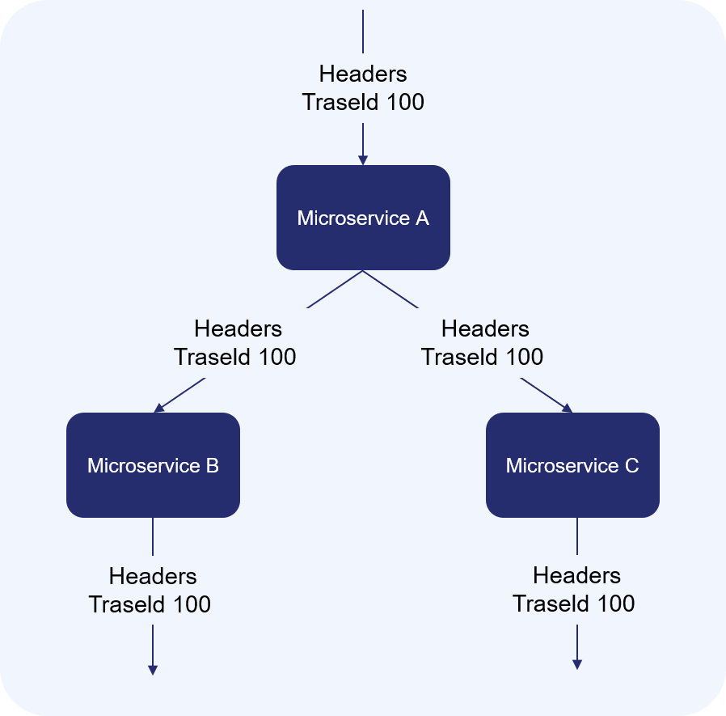
Паттерн Distributed Tracing разработан для решения проблемы отслеживания распределенных транзакций.
Он предлагает назначать каждому внешнему запросу уникальный идентификатор (TraceId), который будет передаваться всем сервисам, участвующим в обработке запроса, и фиксироваться в журналах.

Хотя тема мониторинга может показаться несвязанной с задачами системного анализа, она часто становится источником серьёзных проблем, особенно при запуске системы в эксплуатацию. Чтобы избежать таких ситуаций, существуют определённые паттерны: паттерн централизованного ведения логов и паттерн распределённой трассировки. Эти подходы тесно связаны с такими концепциями, как Saga (см. первую часть статьи), распределёнными транзакциями и управлением ими. Например, при использовании любого метода управления распределёнными транзакциями (оркестровка или хореография), каждый микросервис записывает свои логи по данной транзакции. Вопрос в том, как отслеживать одну и ту же транзакцию в разных записях логов?

Как системные аналитики, вы должны предусматривать наличие уникального идентификатора для каждой транзакции, который будет использоваться всеми микросервисами, участвующими в её выполнении. Этот идентификатор поможет связывать логи различных сервисов между собой.

В больших системах мониторинга TraceID обычно назначается автоматически средствами логирования. Однако автоматизация не всегда справляется с задачей корректной идентификации одной и той же операции. Поэтому ваша задача как аналитика — заранее учесть необходимость использования уникального идентификатора в контрактах, если речь идёт о распределённой транзакции. Это позволит вам впоследствии фильтровать и собирать информацию обо всём процессе выполнения операции, анализировать временные задержки и выявлять узкие места производительности.

**Шаблон «Проверка здоровья» (Health Check)**
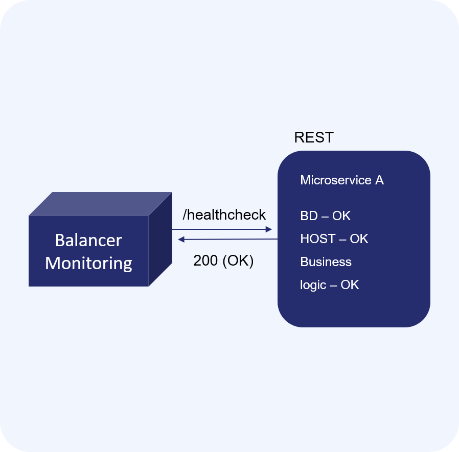
Паттерн Health Check API представляет собой механизм мониторинга, позволяющий в режиме реального времени получать информацию о состоянии отдельных сервисов в приложении на базе микросервисов.

Паттерн Health Check API представляет собой механизм мониторинга, который позволяет в реальном времени получать информацию о состоянии отдельных сервисов в приложении на основе микросервисов.  

Иногда бывает так, что сервис работает, но не может обрабатывать запросы. Например, недавно поднятый инстанс сервиса может все еще инициализироваться и выполнять проверки работоспособности, прежде чем он сможет приступить к обработке запросов.

Во многих системах используются автоматизированные системы мониторинга, предназначенные для контроля работоспособности всех микросервисов. Возможно, в вашей системе тоже имеется единая система мониторинга, и системному аналитику стоит это учитывать. 

Суть в следующем: для интеграции с такой системой мониторинга вам может потребоваться добавить в ваши микросервисы специальный эндпоинт, который будет отправлять запросы в систему мониторинга для проверки состояния вашего сервиса. Вам, как аналитикам, потребуется не только создать этот эндпоинт, но и описать, как он функционирует. При получении запроса на этот эндпоинт, обычно проверяется работоспособность базы данных, доступность хоста и выполнение основной бизнес-логики. Если все эти проверки успешно завершены, сервис сообщает, что всё в порядке. В случае возникновения ошибки хотя бы на одном из этапов, система мониторинга получит уведомление о проблеме, что привлечёт внимание администраторов. Они получат сигнал о необходимости вмешательства, так как что-то пошло не по плану. Именно системный аналитик должен описать такую логику.

#### Прочие паттерны
**Шаблон «Корректное восстановление после ошибок» (Retry)**
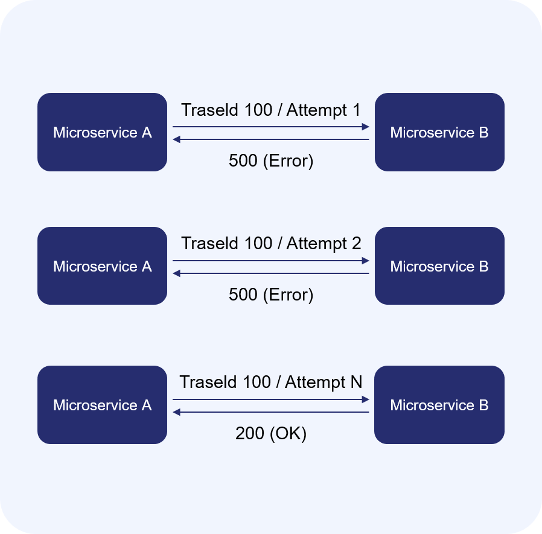
Этот шаблон предусматривает автоматическое повторение неудачной операции, увеличивая вероятность успешного выполнения и минимизируя влияние временных сбоев.
Шаблон Retry позволяет вашим сервисам корректно восстанавливаться после таких проблем, повышая общую стабильность системы.

В чем суть? Бывают ситуации, когда нужно получить данные или отправить их в другой микросервис, но тот не отвечает. Мы получаем ошибку 500, и непонятно, что делать дальше. Тогда мы обращаемся повторно. Мы пробуем снова связаться с сервисом, надеясь получить необходимый результат. Важно при этом не перегрузить сервис запросами. Поэтому системный аналитик определяет стратегию retry: сколько попыток сделать, с каким интервалом и как поступить, если все попытки окажутся неудачными. Нужно решить, продолжать ли попытки или прекратить их после определенного количества неудач. 

Что делать, если ни одна попытка не увенчалась успехом? Продолжаем ли мы выполнение задачи или прекращаем ее? Здесь возникает дилемма: с одной стороны, нам нужно получить/передать данные, с другой — нельзя перегружать сервис. Если в системе предусмотрена защита от каскадных сбоев, можно повторять запросы неограниченное количество раз, поскольку это не навредит сервису. Если же такой защиты нет, приходится тщательно продумывать стратегию действий. Например, можно установить три попытки с интервалом в пять секунд. Если после этих попыток ответ не получен, дальнейшие попытки прекращаются. Иногда делают так: после получения ошибки вторая попытка — через пять секунд, третья — через десять секунд и так далее, постепенно увеличивая интервал. Через определенное время, скажем, через минуту, если ответ так и не был получен, процесс завершается. Но все эти настройки задержек между запросами индивидуальны и продумываются для каждого сервиса отдельно. 

Как системные аналитики, мы отвечаем за внедрение стратегии retry. Так что будьте готовы к вопросу от разработчиков: «Что делать, если сервис не отвечает?». Ответственность за принятие решения лежит на системном аналитике. Помните о шаблоне retry, особенно если в системе отсутствует защита от каскадных сбоев. 

