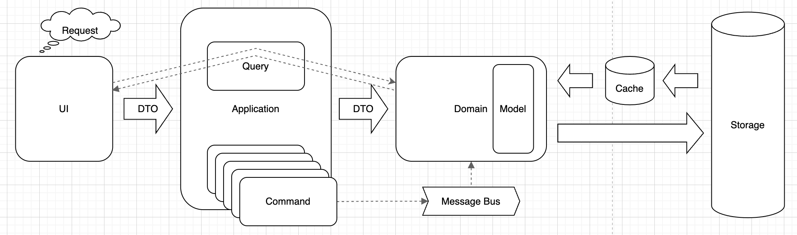
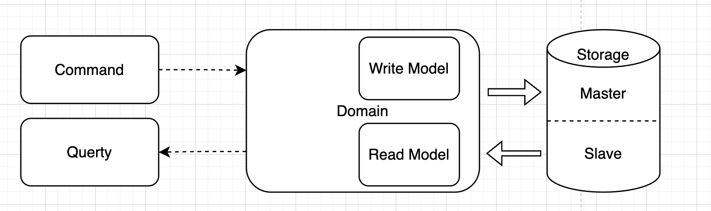
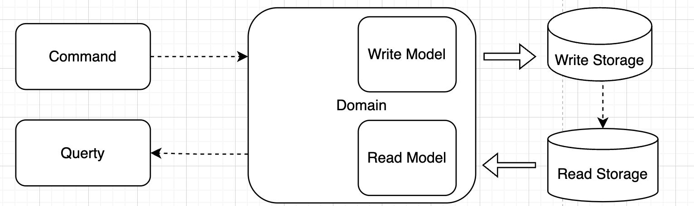
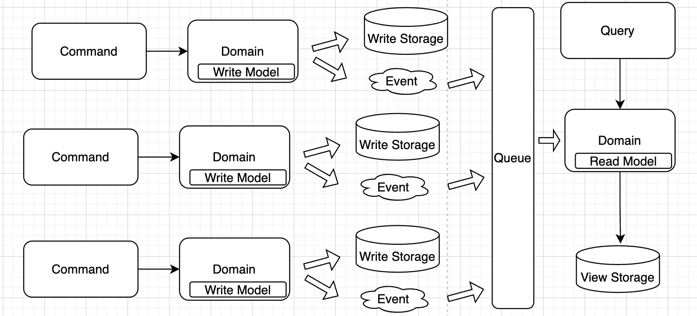

### CQS (CQRS)

#### Командно-запросное разделение (Command-query separation, CQS)
Принцип программирования CQS (Command-query Separation) предполагает, что каждая функция в проекте может выполнять только команду (любое активное действие) или только запрос по извлечению данных. 

Правила:
- Команды и запросы не смешиваются
- Single Responsibility (SRP)
- Нет влияние на запросы
- Простота в реализации

#### Command Query Responsibility Segregation (CQRS)
Command Query Responsibility Segregation (CQRS) — это разделение модели на read и write. Предполагается в одну пишем, с нескольких можем читать. М — масштабирование. Базируется на CQS.

Правила:
- Раздельная модель данных
- Логика запросов и команд разделена
- Целостность данных
- Атомарность команд 
- Асинхронная обработка данных
