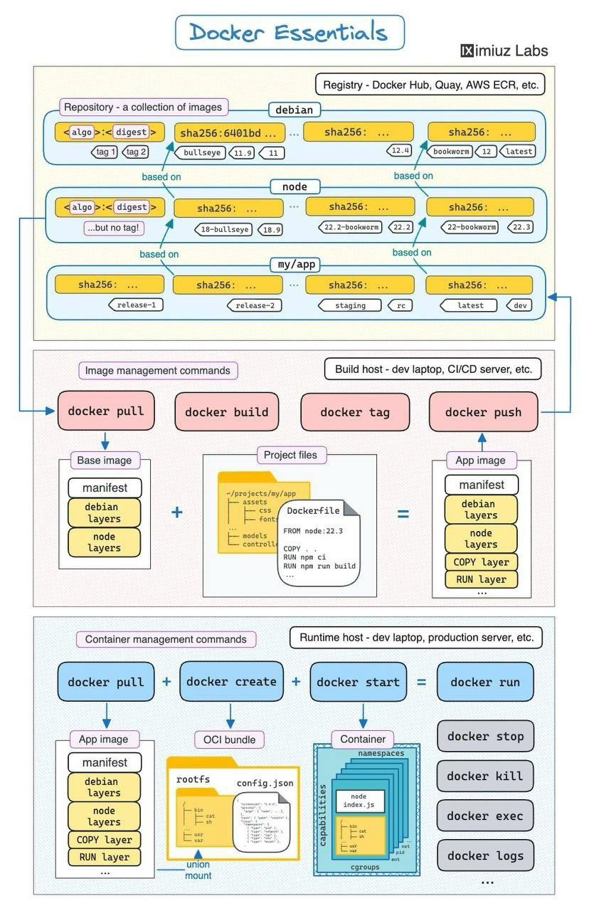

### Основные концепции Docker



#### Практики Docker
- _**Игнорирование файлов при сборке.**_ Когда вы запускаете сборку образа, Docker-клиент ищет в корне контекста файл .dockerignore. Если он найден, все файлы и каталоги, подпадающие под его шаблоны, исключаются из контекста ещё до того, как будут переданы билдеру.

- _**Многоступенчатая сборка (multi-stage builds)**_ Multi-stage позволяет в одном Dockerfile отделить стадию сборки (с компиляторами, dev-зависимостями) от стадии рантайма. В результате финальный образ содержит только необходимые двоичные файлы и библиотеки — меньше места и быстрее старт.
```yaml
FROM golang:1.24 AS build
WORKDIR /app
COPY go.mod go.sum ./
RUN go mod download
COPY . .
RUN CGO_ENABLED=0 go build -o /app/bin/app ./cmd/app

FROM alpine:3.20
RUN adduser -D appuser
COPY --from=build /app/bin/app /usr/local/bin/app
USER appuser
CMD ["/usr/local/bin/app"]
```
AS build даёт именованный этап, откуда потом COPY --from=build берёт файлы.

- _**Типы Mounts**_ BuildKit позволяет в инструкциях RUN использовать дополнительные монтирования (mounts), чтобы облегчить сборку образов. Типы монтирования:
    - **bind** погрузить директорию или файл из файловой системы хоста в контейнер, для использования в RUN.
    - **cache** кэшировать директории между сборками, ускорить установку зависимостей, компиляцию и др.
    - **ssh** давать доступ к SSH-агенту или ключам для клонирования приватных репозиториев или других SSH-операций.
    - **secret** безопасно передавать секреты (API-ключи, пароли и др.), не включать их в итоговый образ.

- **Здоровье контейнеров: HEALTHCHECK** Иногда сервис формально запущен, но внутри него процесс повис или работает некорректно. Docker позволяет описать внутри образа команду для проверки состояния контейнера.

- **Log drivers: управление логами** По умолчанию Docker сохраняет логи в JSON-файл. Но это далеко не всегда удобно. Для интеграции с системами мониторинга можно выбрать другие драйверы

- **Docker login** 

#### Игнорирование файлов при сборке
Когда вы запускаете сборку образа, Docker-клиент ищет в корне контекста файл .dockerignore. Если он найден, все файлы и каталоги, подпадающие под его шаблоны, исключаются из контекста ещё до того, как будут переданы билдеру.

#### Многоступенчатая сборка (multi-stage builds)
Представьте, что у вас есть приложение на Go или C++, которое сначала нужно скомпилировать, а затем запустить в контейнере. Если вы используете один контейнер для всего процесса, образ получается тяжёлым: там присутствуют компиляторы, библиотеки для разработки и прочее.
Multi-stage позволяет в одном Dockerfile отделить стадию сборки (с компиляторами, dev-зависимостями) от стадии рантайма. В результате финальный образ содержит только необходимые двоичные файлы и библиотеки — меньше места и быстрее старт
Multi-stage позволяет разделять сборку и рантайм в одном Dockerfile. В первом контейнере в FROM ставится образ с компилятором (golang:1.22.2), во втором — минимальный рантайм (alpine, distroless), ==куда копируется готовый исполняемый файл==. В итоге финальный образ весит считаные мегабайты.
```yaml
FROM golang:1.24 AS build
WORKDIR /app
COPY . .
RUN go build -o /app/bin/app

FROM alpine:3.20
COPY --from=build /app/bin/app /usr/local/bin/app
CMD ["app"]
```

AS build даёт именованный этап, откуда потом COPY --from=build берёт файлы.

#### Типы Mounts
BuildKit позволяет в инструкциях RUN использовать дополнительные монтирования (mounts), чтобы облегчить сборку образов. Типы монтирования:
1. **Bind (type=bind)**
   Подключает (mount) файлы или директории внутрь контейнера в момент RUN, без копирования в образ. То есть, содержимое доступно для команды, но не сохраняется после окончания RUN, если только команда явно не скопирует его куда-то.
```yaml
# syntax=docker/dockerfile:1.3
FROM node:16

RUN --mount=type=bind,source=./tools,target=/app/tools \
    ./tools/setup.sh
```
Опции:
  - target / dst — путь внутри контейнера, куда монтируется.
  - source / src — путь внутри from. Значение по умолчанию — корень from.
  - from — Build stage, context, или имя образа для установки корня source.
  - rw / readwrite — разрешить запись на mount. Записанные данные не сохраняются.

2. Cache (type=cache)
   Дать возможность накапливать результат каких-то операций между сборками, чтобы не запускать полную работу заново. Часто используется для пакетных менеджеров, компиляторов, apt/dpkg, pip, npm, go, ccache и т. д.
```yaml
# syntax=docker/dockerfile:1.3
FROM python:3.11

WORKDIR /app

COPY requirements.txt .

RUN --mount=type=cache,target=/root/.cache/pip \
    pip install -r requirements.txt

COPY . .

RUN python setup.py install
```
Опции:
  - target — где внутри контейнера будет располагаться кэш.
  - id — идентификатор кэша, чтобы отделять разные кэши, если нужно. По умолчанию часто равен пути target.
  - sharing — как кэш может быть использован: shared, private, locked.
  - shared — разные билд-команды (писатели) могут одновременно писать.
  - private — каждый писатель получит «свой» кэш mount.
  - locked — второй писатель ждёт, пока первый освободит mount.
  - from — Создание stage, context, или имени изображения для использования в качестве базы для монтирования кэша. По умолчанию — пустая директория.
  - ro / readonly — если нужно только чтение из кэша.
  - source — путь внутри from. Значение по умолчанию — корень from.
  - mode — права доступа для новой кэш-директории в восьмеричном формате. По умолчанию: 0755.
  - uid — идентификатор пользователя для новой кэш-директории. По умолчанию: 0.
  - gid — идентификатор группы для новой кэш-директории. По умолчанию: 0.

3. SSH (type=ssh)
   Если учётные данные, которые вы хотите использовать в своей сборке, являются сокетом или ключом SSH, вы можете использовать mount SSH вместо secret mount. Клонирование частных репозиториев Git является распространённым вариантом использования для mount SSH.
```yaml
# syntax=docker/dockerfile:1.4
FROM ubuntu:22.04

RUN --mount=type=ssh git clone git@github.com:myorg/private.git /src/private
```
Опции:
  - id — идентификатор ssh.
  - target — куда в контейнере монтировать ssh сокет / ключ.

4. Secret (type=secret)
   Когда нужны конфиденциальные данные во время сборки: API-ключи, токены, credentials, приватные конфигурации. Нужно, чтобы они были доступны только во время RUN, и не остались в конечном образе.
```bash
docker build --secret id=mysecret,src=/local/path/to/secret.txt .
```
```dockerfile
RUN --mount=type=secret,id=mysecret \
    some-command-that-needs-secret /run/secrets/mysecret
```
Опции:
  - id — имя секрета.
  - target — куда монтировать (если не дефолтное /run/secrets/).
  - required=true/false — если секрет обязателен, и сборка должна провалиться, если его нет.
  - mode, uid, gid — права доступа к файлу.

#### Здоровье контейнеров: HEALTHCHECK
Иногда сервис формально запущен, но внутри него процесс повис или работает некорректно. Docker позволяет описать внутри образа команду для проверки состояния контейнера.
```dockerfile
HEALTHCHECK --interval=30s --timeout=10s --start-period=15s --retries=3 \
  CMD curl -f http://localhost:8080/ || exit 1
```
Опции:
  - --timeout — если ответ на запрос не приходит в течение этого времени, то запрос считается неуспешным.
  - --start-period — даёт службе время на старт, прежде чем начинать проверки.
  - --interval — время между проверками.
  - --retries — число неудачных попыток до перехода в unhealthy.

#### Log drivers: управление логами
По умолчанию Docker сохраняет логи в JSON-файл. Но это далеко не всегда удобно. Для интеграции с системами мониторинга можно выбрать другие драйверы. Docker поддерживает несколько драйверов логирования (json-file по умолчанию, syslog, journald, fluentd, gelf и т. д.)
Пример запуска контейнера с syslog:
```bash
docker run --log-driver=syslog nginx:1.27
```
Или задать дефолт для всех контейнеров в /etc/docker/daemon.json:
```json
{
  "log-driver": "local",
  "log-opts": {
    "max-size": "10m",
    "max-file": "3"
  }
}
```
Docker поддерживает несколько встроенных драйверов:
  - json-file — стандартный вариант, пишет логи в локальные JSON-файлы.
  - local — похож на json-file, но использует более компактное бинарное хранение и лучше масштабируется.
  - syslog — отправляет логи в системный журнал.
  - journald — интеграция с systemd и journalctl.
  - fluentd — пересылает логи в Fluentd-агент.
  - gelf — передаёт сообщения в Graylog или Logstash через протокол GELF.
  - awslogs, splunk, datadog, gcplogs, logentries — отправляют логи в облачные или коммерческие системы.

#### Docker login

#### Dive: Рентген для образов
Dive — это инструмент с текстовым интерфейсом, который позволяет визуально исследовать каждый слой вашего образа. Вы можете пощупать файловую систему контейнера на каждом этапе его сборки. Когда вы запускаете команду:
```
dive <тег-или-id-образа>
```

#### SlimToolkit: Автоматическая минимизация контейнеров
Это инструмент для автоматической минимизации размера образа и безопасности контейнеров.

#### Docker Events
Команда docker system events (алиас docker events) подключается к серверу Docker и начинает транслировать поток информации обо всех изменениях состояний. Похоже на чтение логов, но на уровне оркестратора. Вы видите события создания контейнеров, их запуска, остановки, уничтожения, подключения к сетям, монтирования томов и обновления образов.

#### Docker Sandbox: Безопасная песочница для ИИ-агентов
С развитием генеративного искусственного интеллекта и LLM возникла проблема безопасности выполнения кода, написанного нейросетью. Когда вы просите ИИ написать и выполнить скрипт, запускать его на своей основной машине или даже в стандартном контейнере может быть рискованно.
```
docker sandbox run <agent>:
```

#### Memory-swap: Тонкая настройка памяти
Управление ресурсами это важная часть эксплуатации контейнеров, про которую часто забывают до первого падения сервера по Out Of Memory. Большинство знает про флаг --memory, ограничивающий потребление RAM. Но есть второй, не менее важный параметр — memory-swap, который определяет, как контейнер может использовать файл подкачки.

#### Docker Offload: Облачная мощь для локальной разработки
Docker Offload — это полностью управляемый облачный сервис, который позволяет переносить сборку и запуск контейнеров в облако, используя те же инструменты Docker, что и на локальной машине. Он помогает разработчикам работать без ограничений в средах VDI или на системах, где нет поддержки вложенной виртуализации.
