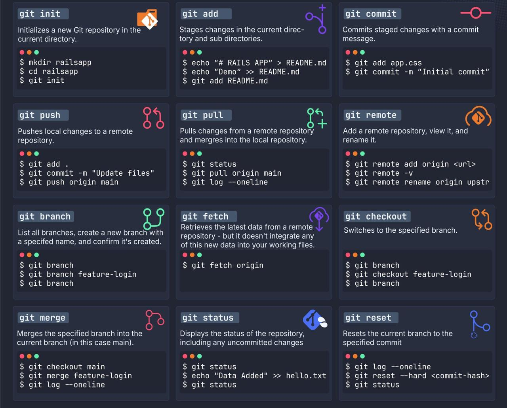

### Список команд Git


#### Отмена коммита
Для отмены последнего коммита в Git можно использовать команду git reset. Существует несколько способов использования git reset, в зависимости от того, как вы хотите сохранить изменения: git reset --soft HEAD~1 (сохраняет изменения в индексе), git reset --mixed HEAD~1 (сохраняет изменения в рабочей директории, это поведение по умолчанию) и git reset --hard HEAD~1 (полностью отменяет изменения, удаляя их из репозитория). Также можно использовать git revert, который создаёт новый коммит, отменяющий изменения предыдущего коммита.

#### Слияние коммитов
```
git checkout main
git merge --squash feature4
git commit -m "feature4"
```

