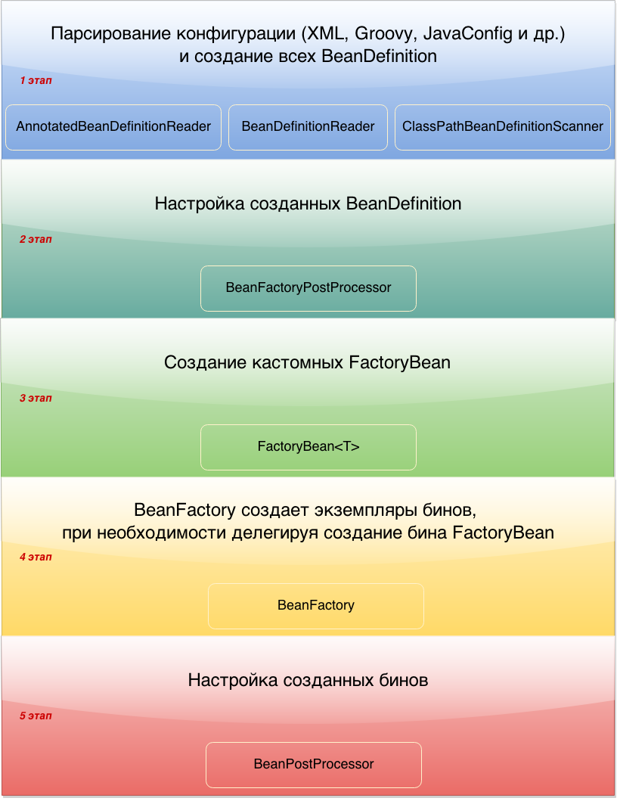

### Инициализация Spring Bean



#### Парсирование конфигурации и создание BeanDefinition
После выхода четвертой версии спринга, у нас появилось четыре способа конфигурирования контекста:
- Xml конфигурация — ClassPathXmlApplicationContext(“context.xml”)
- Конфигурация через аннотации с указанием пакета для сканирования — AnnotationConfigApplicationContext(“package.name”)
- Конфигурация через аннотации с указанием класса (или массива классов) помеченного аннотацией @Configuration -AnnotationConfigApplicationContext(JavaConfig.class). Этот способ конфигурации называется — JavaConfig.
- Groovy конфигурация — GenericGroovyApplicationContext(“context.groovy”)

#### Настройка созданных BeanDefinition

После первого этапа у нас имеется Map, в котором хранятся BeanDefinition. Архитектура спринга построена таким образом, что у нас есть возможность повлиять на то, какими будут наши бины еще до их фактического создания, иначе говоря мы имеем доступ к метаданным класса. Для этого существует специальный интерфейс BeanFactoryPostProcessor, реализовав который, мы получаем доступ к созданным BeanDefinition и можем их изменять. В этом интерфейсе всего один метод.
```java
public interface BeanFactoryPostProcessor {
	void postProcessBeanFactory(ConfigurableListableBeanFactory beanFactory) throws BeansException;
}
```

####  Создание кастомных FactoryBean
FactoryBean — это generic интерфейс, которому можно делегировать процесс создания бинов типа . В те времена, когда конфигурация была исключительно в xml, разработчикам был необходим механизм с помощью которого они бы могли управлять процессом создания бинов. Именно для этого и был сделан этот интерфейс. Для того что бы лучше понять проблему, приведу пример xml конфигурации.

####  Создание экземпляров бинов

Созданием экземпляров бинов занимается BeanFactory при этом, если нужно, делегирует это кастомным FactoryBean. Экземпляры бинов создаются на основе ранее созданных BeanDefinition.

#### Настройка созданных бинов

Интерфейс BeanPostProcessor позволяет вклиниться в процесс настройки ваших бинов до того, как они попадут в контейнер. Интерфейс несет в себе несколько методов.
```java
public interface BeanPostProcessor {
	Object postProcessBeforeInitialization(Object bean, String beanName) throws BeansException;
	Object postProcessAfterInitialization(Object bean, String beanName) throws BeansException;
}
```
Оба метода вызываются для каждого бина. У обоих методов параметры абсолютно одинаковые. Разница только в порядке их вызова. Первый вызывается до init-метода, второй, после. Важно понимать, что на данном этапе экземпляр бина уже создан и идет его донастройка. Тут есть два важных момента:
- Оба метода в итоге должны вернуть бин. Если в методе вы вернете null, то при получении этого бина из контекста вы получите null, а поскольку через бинпостпроцессор проходят все бины, после поднятия контекста, при запросе любого бина вы будете получать фиг, в смысле null.
- Если вы хотите сделать прокси над вашим объектом, то имейте ввиду, что это принято делать после вызова init метода, иначе говоря это нужно делать в методе postProcessAfterInitialization.

Процесс донастройки показан на рисунке ниже. Порядок в котором будут вызваны BeanPostProcessor не известен, но мы точно знаем что выполнены они будут последовательно.


