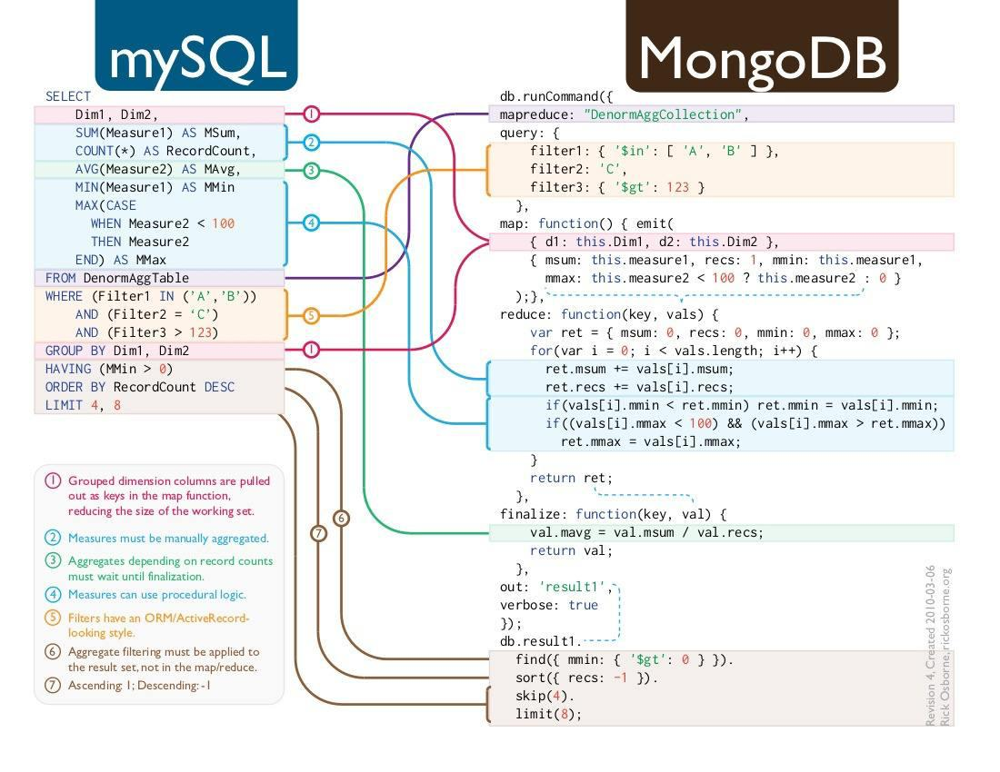

### DBMS краткие заметки

#### Индексы

**B-tree (по умолчанию)**

- Лучший выбор для: =, <, >, BETWEEN, ORDER BY.
- Поддерживает сортировку.
- Используется в 90% случаев.Используется в 90% случаев.

```sql
CREATE INDEX idx_users_name ON users(name);
```

**Hash**

- Только для точного сравнения =.
- Не поддерживает диапазоны, сортировку, LIKE.
- Редко используется, но может быть быстрее B-tree на =.

```sql
CREATE INDEX idx_users_email_hash ON users USING hash(email);
```

**GIN (Generalized Inverted Index)**

- Для массивов, jsonb, full-text search.
- Отличен при поиске по вложенным структурам или множеству значений.

```sql
CREATE INDEX idx_data_tags ON posts USING gin(tags);
```

**GiST (Generalized Search Tree)**

- Для геоданных (PostGIS), поиска по диапазонам, tsvector.
- Более универсален, но медленнее в некоторых кейсах, чем GIN.

```sql
CREATE INDEX idx_events_location ON events USING gist(location);
```

**BRIN (Block Range Index)**

- Для огромных таблиц, где данные физически упорядочены.
- Занимает очень мало места.
- Не всегда эффективен — зависит от корреляции данных.

```sql
CREATE INDEX idx_logs_timestamp ON logs USING brin(timestamp);
```

#### Типичные проблемы с типами данных

- **TIMESTAMP (WITHOUT TIME ZONE)** - используется по default. Нет смысла использовать TIMESTAMP (WITHOUT TIME ZONE), так как это может привести к ошибкам при вычислениях из-за отсутствия контекста часового пояса и перехода на летнее/зимнее время. Правильный тип для хранения временных меток как конкретных моментов времени — TIMESTAMP WITH TIME ZONE.
- **TIME WITH TIME ZONE** - включён в PostgreSQL только ради соответствия SQL-стандарту. Поскольку он также занимает 8 байт, нет никакой причины его использовать — вместо него рекомендуется использовать TIMESTAMPTZ.
- **CURRENT_TIME** - Если вы решите использовать CURRENT_TIME, вы столкнётесь с теми же проблемами, что и при работе с TIMETZ. Выбор нужно опираться на


| Функция                 | Тип возвращаемого значения | Пример результата |
| ------------------------------ | -------------------------------------------------- | --------------------------------- |
| CURRENT_TIMESTAMP или now() | timestamp with time zone                           | 2023-11-20 21:03:34.349275+00     |
| CURRENT_DATE                   | date                                               | 2023-11-20                        |
| CURRENT_TIME                   | time with time zone                                | 21:03:34.349275+00                |
| LOCALTIMESTAMP                 | timestamp without time zone                        | 2023-11-20 21:03:34.349275        |
| LOCALTIME                      | time without time zone                             | 21:03:34.349275                   |

- **CHAR(n)** - Это текстовый тип фиксированной длины с заполнением пробелами. Его длина всегда равна n, как указано в определении. Если строка короче n символов, оставшееся пространство дополняется пробелами. Но будьте осторожны: при использовании LIKE и регулярных выражений (regex) пробелы не игнорируются! Что ещё хуже — внутри PostgreSQL тип CHAR(n) не хранится как поле фиксированной длины. Поскольку символы могут занимать более одного байта (в зависимости от кодировки), сохраненная строка на диске представлена в виде значения переменной длины. В результате вы можете тратить место на диске впустую, сохраняя ненужные пробелы, так как они сохраняются явно. Наконец, индексы, созданные по колонкам с типом CHAR(n), могут не работать в запросах, где используется значение типа TEXT, переданное из клиента PostgreSQL.
- **VARCHAR(n)** При попытке вставить более длинную строку произойдёт ошибка: ERROR:  value too long for type character varying(5). Итог: не используйте VARCHAR(n), он может только создать проблемы, не давая при этом никаких преимуществ. Используйте TEXT.
- **Тип BPCHAR** - Игнорирует при сравнение пробелы в конце строки.
- **MONEY** - не хранит информацию о валюте и страдает от ограниченной и ошибочной реализации. Его следует избегать и вместо него использовать NUMERIC или другие числовые типы, способные точно хранить значения. При необходимости валюту лучше сохранять в отдельной колонке.
- **Тип данных SERIAL  и BIGSERIAL** - фактически устарели и были вытеснены identity-колонками, которые обладают более предсказуемым поведением в плане владения последовательностями, их использования и понятности, к какой таблице они относятся.
- **XML** — крайне неудачный выбор для хранения документов, если только вы не собираетесь просто копировать неизменяемые XML-данные в базу. Если вы планируете выполнять запросы или модифицировать данные, используйте JSON(B).

#### Fillfactor

**Fillfactor** — это параметр, который говорит PostgreSQL: оставь немного места на каждой странице, пожалуйста, заранее. То есть если ты ставишь fillfactor = 80, то Postgres будет заполнять каждую страницу на 80%, оставляя 20% под будущие апдейты. По дефолту fillfactor = 100. А значит, если часто происходят UPDATE или HOT UPDATE, можно влететь в проблему — Postgres не сможет обновить строку “на месте” и вынужден будет делать tuple forwarding (и создавать новый tuple), что ведёт к фрагментации и росту таблицы.

```sql
CREATE TABLE users (
  id serial PRIMARY KEY,
  name text,
  email text
) WITH (fillfactor = 80);

ALTER TABLE users SET (fillfactor = 70);

CREATE INDEX idx_email ON users(email) WITH (fillfactor = 90);
```

**Когда стоит занижать fillfactor вручную**

*Не трогай fillfactor, если не уверен в профиле нагрузки. По дефолту он справедлив — 100%.*

- Частые UPDATE’ы фиксированных строк
- Типичный кейс — статус заказа. Меняется несколько байт, но меняется часто.
- **Frequent UPSERT паттерны** Особенно если UPSERT делают UPDATE чаще, чем INSERT.
- **Суровые OLTP-нагрузки** Где каждый микросервис по 100 раз в секунду пишет в те же записи (а ты ещё решил shard'ить вручную, да?).
- **Частые UPDATE по jsonb / text** Где строка может даже слегка вырасти.

#### Стратегии управления транзакциями

В контексте баз данных, "ACID" и "BASE" - это два различных подхода к управлению транзакциями, определяющие, как данные обрабатываются и какие гарантии надежности и согласованности предоставляются. ACID (Atomicity, Consistency, Isolation, Durability) - это классический подход, обеспечивающий строгую согласованность данных, в то время как BASE (Basically Available, Soft state, Eventually consistent) - более гибкий подход, нацеленный на высокую доступность и отказоустойчивость, жертвуя некоторой степенью согласованности

#### ACID

Это традиционный подход, часто используемый в реляционных базах данных, таких как PostgreSQL. Он обеспечивает надежность и предсказуемость работы, но может быть более медленным и менее масштабируемым, особенно в распределенных системах.

**ACID** - Atomicity, Consistency, Isolation, Durability

- **Atomicity(Атомарность)** Гарантирует, что транзакция либо выполняется полностью, либо не выполняется вообще. Никакие частичные изменения не сохраняются.
- **Consistency(Согласованность)** Обеспечивает, что любая транзакция переводит базу данных из одного согласованного состояния в другое, то есть не нарушает предустановленные правила и ограничения.
- **Isolation(Изолированность)** Обеспечивает, что параллельно выполняющиеся транзакции не влияют друг на друга, создавая иллюзию последовательного выполнения.
- **Durability(Долговечность)** Гарантирует, что после подтверждения транзакции изменения сохраняются и не будут потеряны даже в случае сбоя системы.

#### BASE

Это подход, ориентированный на доступность и масштабируемость, часто используемый в NoSQL базах данных. Он позволяет достичь высокой производительности и отказоустойчивости за счет упрощения требований к согласованности данных, что делает его подходящим для распределенных систем, где требуется высокая доступность.

**BASE** - Basically Available, Soft state, Eventually consistent

- **Basically Available(Базовая доступность)** Гарантирует, что база данных будет доступна в любом случае.
- **Soft state(Мягкий состав)** Позволяет хранить несогласованные изменения, но не гарантирует их надежности.
- **Eventually consistent(Возможно согласованная)** Гарантирует, что данные будут согласованы в конечном состоянии, но не гарантирует их надежности.

**MySQL vs MongoDB**



**Быстрая справка по масштабированию баз данных**


1. **Индексация:** Проверьте шаблоны запросов вашего приложения и создайте подходящие индексы.
2. **Материализованные представления:** Предварительно вычислите результаты сложных запросов и сохраните их для более быстрого доступа.
3. **Денормализация:** Уменьшите количество сложных объединений для повышения производительности запросов.
4. **Вертикальное масштабирование:** Увеличьте мощность вашего сервер базы данных, добавляя больше процессоров, оперативной памяти или хранилища
5. **Кэширование:** Сохраните часто запрашиваемые данные в более быстром слое хранения для снижения нагрузки на базу данных.
6. **Репликация:** Создайте реплики основной базы данных на разных серверах для масштабирования чтения.
7. **Шардинг:** Разделите таблицы базы данных на более мелкие части и распределите их по серверам. Используется для масштабирования как записи, так и чтения.

#### Оптимизация запросов: Индексы vs. Анализ плана выполнения 

Сейчас я покажу вам, почему простое добавление индексов не всегда ускоряет запросы. Часто встречаю ситуацию, когда разработчики по умолчанию добавляют индексы на каждое поле WHERE, но запросы всё равно работают медленно. Давайте разберёмся!  
**Миф: индексы всегда ускоряют запросы**
На самом деле, индекс может даже замедлить выполнение, если:  
- Запрос возвращает слишком много строк - сканирование индекса будет дороже, чем полное сканирование таблицы.  
- Индекс не покрывает весь запрос - приходится делать обращения к основной таблице.  
- Слишком много индексов - это замедляет INSERT/UPDATE/DELETE.  

**Как правильно анализировать?**  

Используйте EXPLAIN ANALYZE (PostgreSQL) или EXPLAIN FORMAT=JSON (MySQL) для понимания:  
- Используется ли индекс?  
-  Сколько строк проходит сканирование?  
-  Есть ли операции сортировки, которые можно избежать с индексом?  

**Что делать, если запрос медленный?**  

1. Проверить план выполнения (не добавлять индекс вслепую!).  
2. Подумать о составных индексах, если запрос фильтрует по нескольким полям.  
3. Проверить, можно ли избежать сортировки (ORDER BY по индексу).  
4. Рассмотреть материализованные представления для сложных агрегатов.  

**Оптимизация SQL-запросов: 5 ключевых техник**
1. **Используйте индексы** Индексы – это ускоритель запросов. Если у вас часто выполняются WHERE, JOIN или ORDER BY по определенному столбцу – создайте для него индекс. Но не переборщите: индексы ускоряют чтение, но замедляют вставку и обновление данных.  
2. **Избегайте SELECT** Выбирайте только нужные столбцы. SELECT * может загружать ненужные данные и нагружать сервер. Лучше указывать конкретные столбцы.  
3. **Нормализация или денормализация?** Иногда стоит разбивать таблицы (нормализация) для устранения дублирования данных. В других случаях – наоборот, объединять (денормализация) ради быстродействия. Анализируйте ситуацию!  
4. **Кеширование запросов** Если запрос выполняется часто и данные редко меняются, используйте QUERY CACHE или внешние кеширующие механизмы (Redis, Memcached).  
5. **Анализируйте планы выполнения** Команда EXPLAIN в MySQL/PostgreSQL покажет, как СУБД выполняет запрос. Это поможет найти узкие места: медленные JOIN'ы, сканы всей таблицы и т.д.
6. **Избегать использование OR** Выполнение операций раздельно с использованием индексов выгодней чем полное сканирование таблицы.

#### Работа с датами

- **Используйте правильный тип данных**  
   Не храните даты в VARCHAR! Всегда используйте DATE, DATETIME или TIMESTAMP. Это не только экономит место, но и ускоряет запросы.  
- **Не используйте NOW() в WHERE без обработки**  
   Запрос вида:  
   ```sql
    SELECT * FROM orders WHERE order_date > NOW() - INTERVAL 7 DAY;
   ```
  может привести к тому, что индексы не будут использоваться. Лучше заранее вычислить диапазон и передать его в запрос.
- **Сравнение по диапазону – ключ к оптимизации**  
   Для фильтрации по дате лучше использовать BETWEEN:  
   ```sql
    SELECT * FROM orders WHERE order_date BETWEEN '2024-02-01' AND '2024-02-07';
   ```
- **Осторожно с часовыми поясами**  
   Если ваш сервис работает глобально, храните время в UTC и конвертируйте на уровне приложения.  
- **Агрегируйте правильно**  
  Часто нужно сгруппировать данные по дням или месяцам:  
   ```sql
    SELECT DATE(order_date) AS order_day, COUNT(*) FROM orders GROUP BY order_day;
   ```
  Но если поле order_date – DATETIME, такие операции могут игнорировать индексы. Лучше использовать GROUP BY DATE_FORMAT(order_date, '%Y-%m-%d') или завести отдельное DATE-поле.

#### В чем разница между SQL и NoSQL базой
SQL бд:
- Сложные запросы и JOIN — когда нужны агрегации и связи между таблицами
- Транзакции ACID — банковские операции, финансовые системы
- Структурированные данные — четкая схема, предсказуемая структура
- Целостность данных — внешние ключи, constraints
- Отчетность и аналитика — сложные SQL-запросы

Подходят для: банковские системы (транзакции), медицинские записи (целостность данных), интернет-магазины (заказы, inventory)

NoSQL бд:
- Большие объемы данных — Big Data, логгирование
- Горизонтальное масштабирование — распределенные системы
- Гибкая схема — часто меняющаяся структура данных
- Высокая производительность записи — IoT, сенсоры, clickstream
- Неструктурированные данные — JSON, документы, графы

Подходят для: проекты, где работают с документами, где нужно обрабатывать огромные объемы данных(например я знаю, что в VK Video используют cassandra в качестве БД), структура данных часто меняется 


