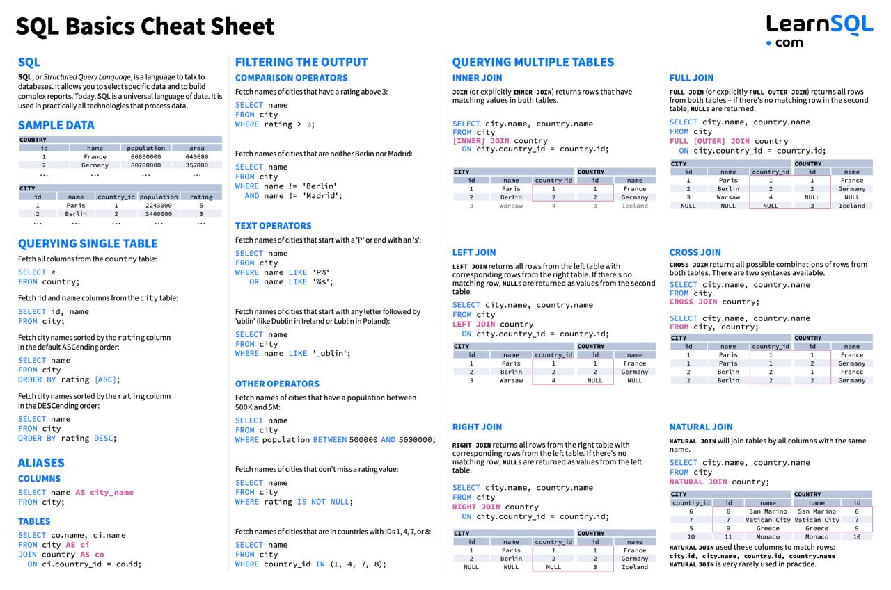

### Универсальная шпаргалка по SQL

#### 25 вопросов с собеседований по SQL
**Базовый уровень:**
1. Что делает команда SELECT и как выбрать все колонки из таблицы?
2. В чем разница между WHERE и HAVING?
3. Что делает GROUP BY и ORDER BY и в каком порядке они выполняются?
4. Как объединить две таблицы? Чем отличаются INNER JOIN, LEFT JOIN, RIGHT JOIN и FULL JOIN?
5. Как выбрать уникальные значения из колонки?

**Средний уровень:**
6. Что делает агрегатная функция и какие бывают (COUNT, SUM, AVG, MAX, MIN)?
7. Как с помощью подзапроса выбрать сотрудников с зарплатой выше средней?
8. Что такое CASE WHEN и как его использовать для логических условий в запросах?
9. Чем отличаются UNION и UNION ALL? Когда что использовать?
10. Как найти дубликаты записей в таблице и удалить их?

**Высокий уровень:**
11. Что такое оконная функция и чем она отличается от GROUP BY?
12. Как найти вторую по величине зарплату в таблице без подзапроса?
13. Что делает COALESCE() и зачем он нужен?
14. Как работают индексы и как они влияют на производительность?
15. Что делает EXPLAIN (или EXPLAIN ANALYZE)? Как понять, где узкое место запроса?

**Продвинутый уровень:**
16. Как реализовать “рекурсивный запрос” с помощью WITH RECURSIVE?
17. Какие есть виды блокировок в базе данных и как это влияет на выполнение запросов?
18. Как соединить таблицу с самой собой (self join) и для чего это может быть нужно?
19. Объясни разницу между INNER JOIN, CROSS JOIN и LATERAL JOIN.
20. Что делает RANK(), DENSE_RANK() и ROW_NUMBER() и в чем между ними разница?
21. Как бы ты посчитал “скользящее среднее” (moving average) по продажам за последние 7 дней?
22. Как посчитать нарастающий итог по сумме продаж?
23. Как найти “дыры” в последовательности (например, пропущенные ID)?
24. Что такое нормализация и денормализация данных, и когда что применять?
25. Как оптимизировать медленный запрос? Назови конкретные приёмы.