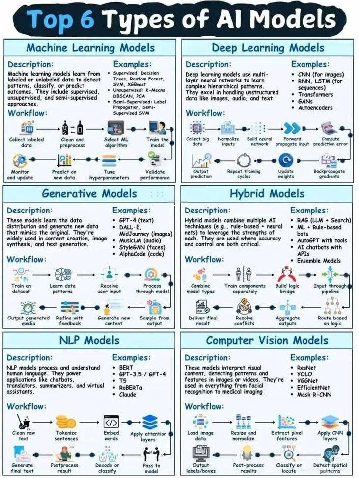

#### Топ 6 типов моделей ИИ

1. Machine Learning Models (Модели машинного обучения)
- Описание: учатся на размеченных или неразмеченных данных для выявления закономерностей, классификации или прогнозирования результатов. Включают подходы с учителем, без учителя и с частичным обучением.
- Примеры: деревья решений, Random Forest, SVM, XGBoost (с учителем); K-Means, DBSCAN, PCA (без учителя); Label Propagation, Semi-Supervised SVM (с частичным обучением).
- Рабочий процесс: сбор размеченных данных → очистка и предобработка → выбор алгоритма ML → обучение модели → мониторинг и обновление → прогнозирование на новых данных → настройка гиперпараметров → проверка производительности.

2. Deep Learning Models (Модели глубокого обучения)
- Описание: используют многослойные нейронные сети для изучения сложных иерархических паттернов, особенно эффективны для неструктурированных данных (изображения, аудио, текст).
- Примеры: CNN (для изображений), RNN, LSTM (для последовательностей), трансформеры, автоэнкодеры.
- Рабочий процесс: сбор больших объёмов данных → нормализация входных данных → построение нейронной сети → передача входных данных → вычисление ошибки предсказания → повторение циклов обучения → обновление весов → обратное распространение градиентов.

3. Generative Models (Генеративные модели)
- Описание: изучают распределение данных и генерируют новые данные, имитирующие исходные. Применяются для создания контента, синтеза изображений и генерации текста.
- Примеры: GPT-4 (текст), DALL·E, MidJourney (изображения), MusicLM (аудио), StyleGAN (лица), AlphaCode (код).
- Рабочий процесс: обучение на датасете → изучение паттернов данных → получение пользовательского ввода → обработка через модель → вывод сгенерированного медиа → уточнение с помощью обратной связи → генерация нового контента → выборка из выходных данных.

4. Hybrid Models (Гибридные модели)
- Описание: комбинируют несколько техник ИИ (например, правила + нейронные сети) для использования преимуществ каждой. Применяются там, где важны точность и контроль.
- Примеры: RAG (LLM + поиск), ML + боты на основе правил, AutoGPT с инструментами, чат-боты с API.
- Рабочий процесс: объединение типов моделей → обучение компонентов отдельно → построение логической связи → ввод через конвейер → получение конечного результата → разрешение конфликтов → агрегация выходных данных → маршрутизация на основе логики.

5. NLP Models (Модели обработки естественного языка)
- Описание: обрабатывают и понимают человеческий язык. Используются в чат-ботах, переводчиках, сумматорах и виртуальных ассистентах.
- Примеры: BERT, GPT-3.5 / GPT-4, T5, RoBERTa, Claude.
- Рабочий процесс: очистка необработанного текста → токенизация предложений → встраивание слов → применение слоёв внимания → генерация финального текста → постобработка результата → декодирование или классификация → передача в модель.

6. Computer Vision Models (Модели компьютерного зрения)
- Описание: интерпретируют визуальное содержимое, выявляя паттерны и особенности в изображениях или видео. Применяются в распознавании лиц, медицинской визуализации и др.
- Примеры: ResNet, YOLO, VGGNet, EfficientNet, Mask R-CNN.
- Рабочий процесс: загрузка данных изображений → изменение размера и нормализация → извлечение пиксельных признаков → применение слоёв CNN → вывод меток/коробок → постобработка результатов → классификация или локализация → обнаружение пространственных паттернов.

